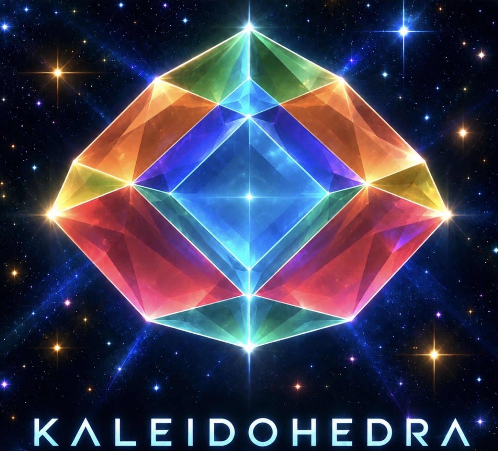

# KALEIDOHEDRA by DICTO

*In development* — live at **[kaleidohedra.vercel.app](https://kaleidohedra.vercel.app)**. The third sibling of [Rhombiverse](https://rhombiverse.vercel.app) and [Polyhedraverse](https://polyhedraverse.vercel.app): lattices you can shear and slide continuously, where every piece of geometry moves with the lattice, and chosen states ("population members") are exported to the two sibling apps. It keeps to the worlds where the shear means something: the 3D+ lattices, the Euclid–Kepler–Pacioli Cell Network and its Studies, Targets, Shells, Golden Rhombohedra, and Nets (2D+), the way from flat nets into 3D. The 1D and 4D–6D worlds live in Rhombiverse.

It grew from shapes DICTO found in Zometool, a golden leaning hexagonal prism and a skewed rhombic dodecahedron that tiles as a sheared FCC (see Polyhedraverse's `docs/dicto-zometool-discoveries.md`), and goes on from there, no longer tied to Zometool.

- `DISCOVERIES.md` — what has been found so far, how each is verified, and whether it is known.
- `TARGETS.md` — the target list: the 160 equal-edge space-filling cells whose edges meet only at special angles, searched both ways (`discover.py`, `discover_run.py`, output `data/geometry-targets.json`). All 160 can be seen in the app's **Targets** world (Wizard → 3D+), alone, with their face neighbours or as a 3×3×3 block; `scripts/verify-targets.mjs` rebuilds each from its data and checks it tiles space.
- `enumerate.py` — the earlier, smaller list (`targets.json`), all included in the new one.
- `assets/brand/` — the logo, with the name (`kaleidohedra-logo.jpg`) and without (`kaleidohedra-mark.jpg`), plus the site icons and preview image, drawn as an orange wireframe of the same shape. The logo shows the regular-hexagon elongated dodecahedron (DISCOVERIES.md #5), which is also the app's live symbol: it turns as a wireframe on the welcome screen and the menu wheels are built on its 12 faces.

## Findings and attribution

Geometry found by **DICTO** in this project, each checked numerically by a script in CI and dated by
the commit that first recorded it (full list, verification and literature status in `DISCOVERIES.md`):

| Finding | First recorded | Literature status |
|---|---|---|
| DICTO skewed rhombic dodecahedron (60° and 72° rhombi, tiles as a sheared FCC) | 2026-10-01 | not found — candidate |
| Regular-hexagon elongated dodecahedron (4 regular hexagons, 4 squares, 4 60° rhombi), reached independently by a new route (the Bain stretch) | 2026-10-01 | known — the truncated octahedron with one zone removed (Grünbaum 2010) |
| DICTO skewed elongated dodecahedra (two forms) | 2026-10-01 | not yet searched |
| Euclid–Kepler–Pacioli cell: cube, dodecahedron, icosahedron, great stellated dodecahedron, octahedron, stella octangula and Pacioli's golden rectangles in one cell, 13 nodes, Pm-3 | 2026-10-06 | not found — candidate |
| Euclid–Kepler–Pacioli network: Kepler's great stellated dodecahedra and icosahedra sharing only corners | 2026-10-06 | not found — candidate |
| EKP windows: carving the six neighbouring stella octangulas out of the dodecahedron leaves 12 Penrose thick rhombi (72°) at its own face angles | 2026-10-08 | not found — candidate |
| Stretched dodecahedron: 8 regular pentagons, 4 hexagons and 2 rectangles at any stretch, squares at one edge | 2026-10-08 | not found — candidate |
| Study of the windows (10a): pushed out by √(7 − 4φ), a convex 74-face solid of 12 Penrose thick rhombi, 6 golden rhombi, 8 equilateral triangles and 48 triangles; buildable from a flat net | 2026-10-08 | study of the windows, not a separate claim |

"Not found" means a web-level search turned up nothing, not proof of novelty. Cite as
*DICTO, Kaleidohedra discoveries, #N (first recorded date), https://doi.org/10.5281/zenodo.23173809*. Each release is archived on Zenodo under that DOI; the latest, [v2026.10.08-convex](https://doi.org/10.5281/zenodo.23220833), adds the windows made convex (recorded there as #12, now study 10a); [v2026.10.08](https://doi.org/10.5281/zenodo.23220273) added #10 and #11.
