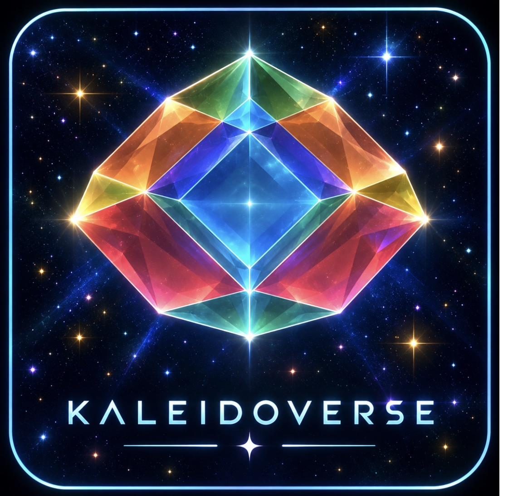

# Kaleidoverse by DICTO

*In development.* The third sibling of [Rhombiverse](https://rhombiverse.vercel.app) and [Polyhedraverse](https://polyhedraverse.vercel.app): lattices you can shear and slide continuously, where every piece of geometry moves with the lattice, and chosen states ("population members") are exported to the two sibling apps.

It grew from shapes DICTO found in Zometool, a golden leaning hexagonal prism and a skewed rhombic dodecahedron that tiles as a sheared FCC (see Polyhedraverse's `docs/dicto-zometool-discoveries.md`), and goes on from there, no longer tied to Zometool.

- `DISCOVERIES.md` — what has been found so far, how each is verified, and whether it is known.
- `TARGETS.md` — the target list: the 160 equal-edge space-filling cells whose edges meet only at special angles, searched both ways (`discover.py`, `discover_run.py`, output `geometry-targets.json`).
- `enumerate.py` — the earlier, smaller list (`targets.json`), all included in the new one.
- `assets/brand/` — the logo, with the name (`kaleidoverse-logo.jpg`) and without (`kaleidoverse-mark.jpg`). It shows the regular-hexagon elongated dodecahedron (DISCOVERIES.md #5) in its face colours.
