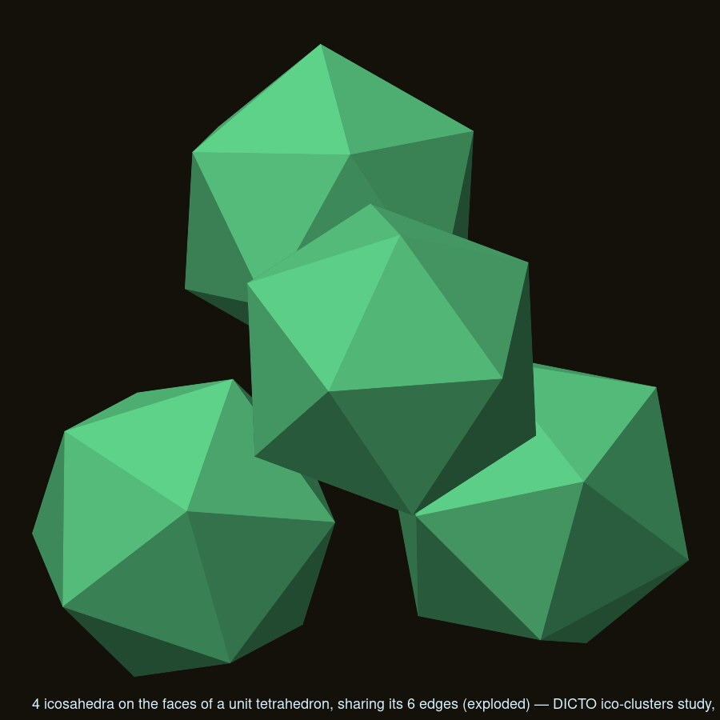
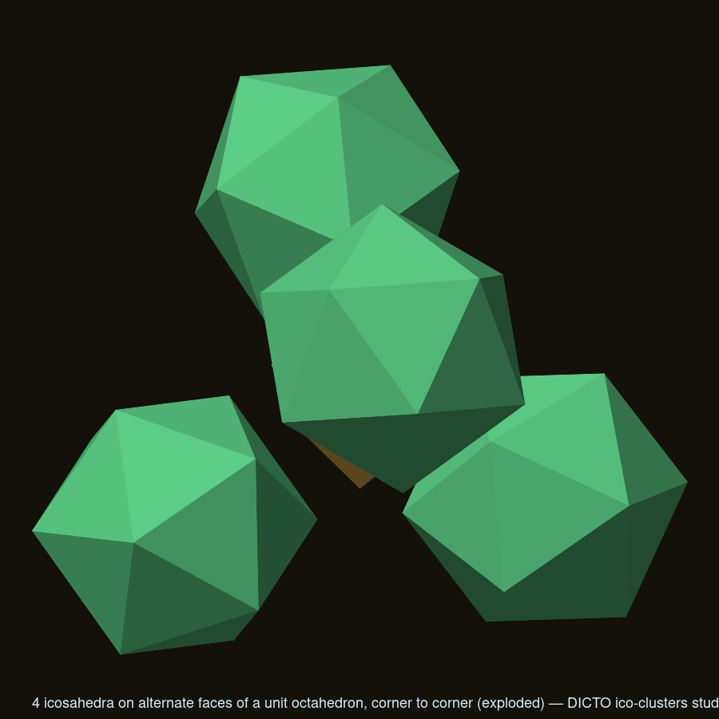
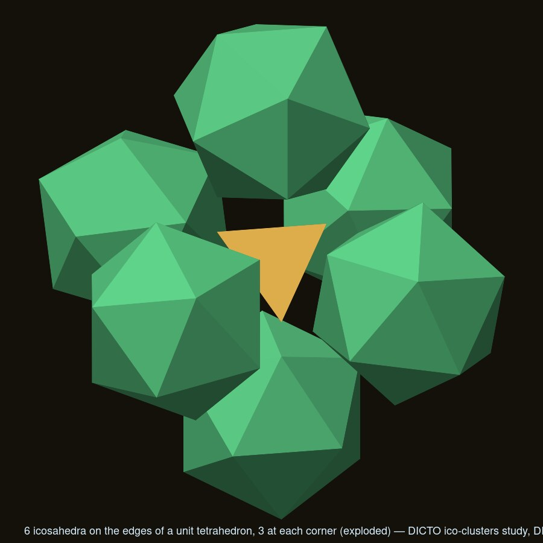
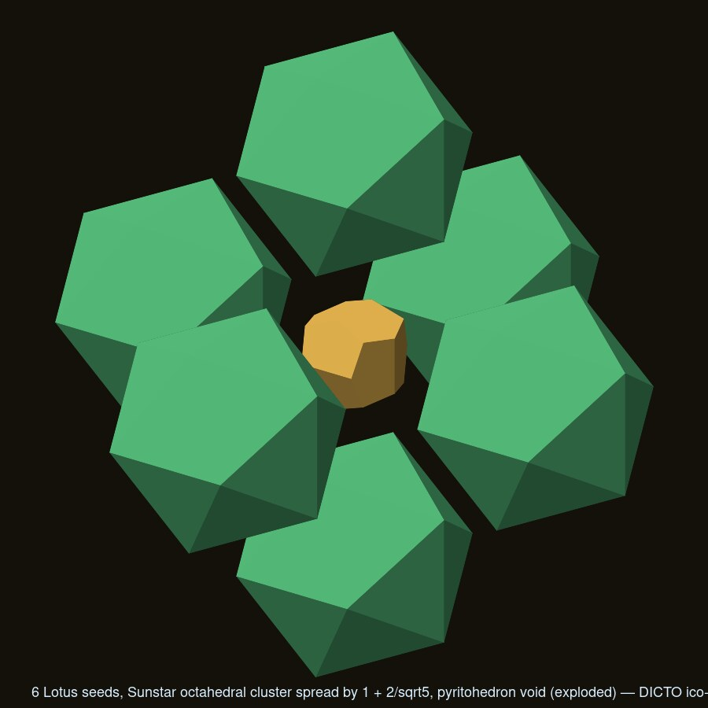

# Ico-clusters: tetrahedral and octahedral clusters of unit icosahedra (DICTO, 2026-10-10)

Research only, no repo changes. Asked: a tetrahedron of 4 and an octahedron of 6 icosahedra "built like" the cube of 8
(sc lattice, spacing φ, shared axial edges, void piece H), as the DICTO Jewel clusters (#15) and Sunstar clusters (#16);
and (added) the Sunstar clusters with every dodecahedron replaced by its Lotus seed (the icosahedron of edge φ²
round it), spread until the seeds meet. Parallel copies sharing whole edges were already ruled out (no 6 two-fold
axes in the 60°/90° pattern), so this searched turned copies, corner and edge sharing, and central pieces.

Scripts: `scan.mjs` (the two one-parameter families, exact touching distance per turn by the separating-axis support
formula, vertex coincidences refined by golden section), `build.mjs` (clusters, contacts, void pieces, networks,
Lotus seeds, writes `data/` and `results.json`), `render.mjs`, `render-all.sh`. Unit scale: icosahedron edge 1; raw
= unit / (φ/2). Numbers: inradius r_i = φ²/(2√3) = 0.755761, midradius φ/2, circumradius R = 0.951057, volume V =
5(3+√5)/12 = 2.181695, dihedral 138.1897°; tetrahedron (edge 1) inradius r_t = 1/(2√6) = 0.204124, octahedron r_o =
1/√6 = 0.408248.

> **Filed 2026-10-10. Names (DICTO):** corner-sharing tetrahedron of 4 = **ICOSA-TET**; corner-sharing octahedron of 6 =
> **ICOSA-OCT**; icosahedron + 8 face-mirrored copies = **Mirrored ICOSA-NON CUBE**; the Lotus pyritohedron (the gap in
> the octahedral Lotus-seed cluster) = **EUCLID Roof Kernel**. The sections below keep the working labels. Research
> scripts stay with the study's working copy.

## Summary

| Cluster | Built? | Contacts | Void piece | Network |
|---|---|---|---|---|
| **Tetrahedron of 4, edge-sharing** | **Yes**: 4 icosahedra on the faces of a unit regular tetrahedron, turned 22.24° off the pyritohedral frame (C3v turn) | 6 **whole edges** (the tetrahedron's) | the **regular tetrahedron, edge 1**, √2/12; all 4 faces whole icosahedron faces (sealed, as the stella in #15); a 13.09° wedge gap outside each edge | diamond (clusters share corner icosahedra; pieces on pyrochlore sites), 0 overlaps, density 0.4006 |
| **Tetrahedron of 4, corner-sharing** | **Yes**: 4 icosahedra on alternate faces of a unit regular octahedron (the other C3v turn, +60°) | 6 **corners** (vertex to vertex, at the octahedron's 6 vertices) | the **regular octahedron, edge 1**, √2/3; 4 faces shared whole, 4 windows | diamond, 0 overlaps, density 0.2246 |
| **Octahedron of 6, corner-sharing** | **Yes**: 6 icosahedra with an axial edge on each edge of a unit regular tetrahedron (2-fold axes on the cube axes, each turned 45°; chiral, mirror at 135°) | 12 corners at only **4 points**: three icosahedra meet at each tetrahedron vertex | the **regular tetrahedron, edge 1** again, √2/12, held by its 6 edges, 4 faces open windows (a cage, not sealed) | simple cubic (perovskite / ReO₃ positions), 0 overlaps, density 0.5207 |
| Octahedron of 6, edge-sharing | **Impossible**: no turn of the family gives two coincident vertices (vertex coincidence only at 45°/135°, one vertex) | | | |
| Any cluster with pairwise **whole faces** | **Impossible**: 4 pairwise needs three face normals at mutual 60°, 6 needs four at 60°/90°; icosahedron face normals meet only at 41.81°, 70.53°, 109.47°, 138.19°, 180°. In the T-family the shared face's normal would be 35.26° from the piece's diagonal 3-fold axis (possible: 0°, 41.81°, 70.53°, …) | | | |
| Octahedral cluster with O or Oh symmetry | **Impossible**: the piece on an axis would need a 4-fold axis; Th-symmetric = all parallel | | | |
| Round a central icosahedron | 4 face-mirrored copies on alternate diagonals never touch one another (gap 0.850651); 6 edge-turned copies never touch (centre distance ≥ √2 φ sin 69.09° = 2.137616 > 2R = 1.902113); **8 face-mirrored copies** on all diagonals touch corner to corner (12 contacts, 0 overlaps): a 9-piece cubic cluster, aside | | | |
| **Lotus seeds in the Sunstar clusters** | **Yes, spread by 1 + 2/√5 = 1.894427**: all seeds parallel (pyritohedral), so the 4- and 6-clusters are the tetrahedral and octahedral holes of one FCC lattice of icosahedra | 6 / 12 **face-on-face partial** contacts: coplanar faces overlap on 0.066158 = 15.28% of a face; no shared vertex | tetra: **regular tetrahedron of edge 2√10/5**, 8√5/75, touching the 4 inner faces on part of their area; octa: a **pyritohedron**, (11+5√5)/100, 12 pentagons in the pieces' face planes, its 6 ridges (length 1/√5) lying on the 6 inner axial edges | FCC lattice of parallel icosahedra, density 0.6797 (Betke–Henk densest lattice packing of the icosahedron: 0.8364); a network, not a filling; no Dogstar counterpart |

## 1. The tetrahedral family

Piece 1 at c(1,1,1) with a 3-fold axis on the diagonal, turned ψ (period 120°); pieces 2–4 its images under the 180°
turns about x, y, z (group T; Td needs the C3v turns ψ = ±22.2388° mod 60°, cos ψ = φ²/(2√2)). For each ψ the exact
touching c*(ψ) is min over separating axes of (max_B − min_A)/((n₁−n₂)·a); c* runs from 0.554190 (ψ = 37.76°) to
0.671988 (ψ = 97.75°). Vertex coincidences (scan 0.05°, refined):

- **ψ = 60° − 22.2388° = 37.7612°, c = 0.554190**: centre radius c√3 = 0.959885 = r_t + r_i, centre distance
  1.567486. Each pair shares a **whole edge**: the four inner faces are the faces of the unit regular tetrahedron, so
  the pieces share its 6 edges. Round each edge: 70.53° (tetrahedron) + 2 × 138.19° = 346.91°, gap **13.0919°**.
  Void = the tetrahedron, 4 whole faces, 0 overlaps (`data/tetra-edge-parts`, `-void`). **Known**: Wolfram
  Demonstrations, "Four Icosahedra around a Tetrahedron" (an icosahedron on each face of a tetrahedron; it names the
  "super tetrahedron / Pearce cluster" of crystallography). Credit Pearce for the arrangement; the sealed-void and
  network reading is this study's.
- **ψ = 97.7612°, c = 0.672041**: centre radius 1.164010 = r_o + r_i, centre distance 1.900820 (just under 2R; the
  touching vertices are off the line of centres). The inner faces are 4 alternate faces of the unit regular
  octahedron; pairs meet **corner to corner** at its 6 vertices. Void = the octahedron, √2/3, 4 whole faces + 4
  windows (`data/tetra-corner-parts`, `-void`). Icosahedra on all 8 faces are impossible: 109.47° + 2 × 138.19° is
  25.85° over 360°.
- ψ = 22.24° (inner faces turned 60°): edge-across-edge contacts, c = 0.558651, no shared vertex. ψ = 0 (parallel):
  §4.

Networks (#17 rule, n = 4 → diamond): neighbouring clusters are the inversion of the cluster through a corner piece
(the piece is its own inverse), so cluster centres form the diamond net and the icosahedra sit on pyrochlore sites,
each in two clusters. Two shells (52 pieces): **0 overlaps** for both clusters; the three 180° turns about the corner
piece's 2-fold axes also give overlap-free neighbours. Densities 16V/(8c)³ = 0.400560 (edge-sharing) and 0.224624
(corner-sharing). Neither fills space: the gaps are connected (no partner piece), as for every icosahedron packing.

## 2. The octahedral family

Piece at (c,0,0) with a 2-fold axis on x, turned ψ (period 180°), the other five by the 3-cycle and the flips (group
T; the O-symmetric cluster is impossible, the Th-symmetric ones are the parallel pieces ψ = 0°, 90°). c* runs from
1.158875 (ψ = 51.85°, vertex-on-face) to 1.192187 (ψ = 170.1°). The only vertex coincidence: **ψ = 45°** (mirror
135°), **c = φ/2 + √2/4 = 1.162570**, centre distance 1.644123. The inner axial edges (at 1/(2√2) from the centre,
turned 45°) are exactly the **6 edges of a unit regular tetrahedron**, so three icosahedra meet at each of its 4
vertices (12 corner contacts, 4 points), and the void is that tetrahedron with all four faces open (the adjacent
icosahedron faces lean 75.6° away from them): a cage, not a sealed piece. No whole-edge sharing at any ψ.
`data/octa-corner-parts`, `-void`. Network (n = 6 → simple cubic): clusters at 2c·Z³ by inversion through corner
pieces, icosahedra at the perovskite X sites, 114 pieces on two shells, **0 overlaps**, density 3V/(2c)³ = 0.520676.

The same tetrahedron serves both: 4 icosahedra on its faces (edge-sharing) or 6 on its edges (corner-sharing), never
both at once (a face piece and an edge piece would need 276° round the edge).

## 3. Central pieces

- Central icosahedron + 4 face-mirrored copies (the mirror through a face plane is the only way to share a whole
  face): outer centres 2 r_i √(8/3) = 2.468306 apart, pieces 0.850651 apart: a star, not a cluster.
- + 8 face-mirrored copies: outer neighbours 1.745356 apart, meeting **corner to corner** (12 contacts, 0 overlaps):
  9 icosahedra, one on each body diagonal (`data/centre-ico-9-parts`, cubic, aside).
- Central icosahedron + 6 copies turned about its axial edges by θ ∈ [138.19°, 221.81°] (the face-mirror at the
  ends): outer centres φ sin(θ/2) ≥ 1.511 from the centre, pairs ≥ 2.137616 apart > 2R: never touch.
- Central tetrahedron / octahedron: these are §1's two clusters. Central small icosahedron: at no turn do 4 inner
  faces match one icosahedron's alternate faces except the mirrored copies above.

## 4. Lotus seeds in the Sunstar clusters (DICTO's idea, added)

The Sunstar lattice (`krp-core src/polyhedra/sunstar.js`) has parallel EKP dodecahedra on the even sites of a cubic
grid (FCC, neighbours along (1,1,0)); the tetrahedral cluster is 4 round a cell corner, the octahedral 6 round an odd
cell's Dogstar. The Lotus seed (icosa-13 §10: dodecahedron + 12 J11 + 30 AXE + 20 FUJI) is the regular icosahedron
of edge φ² in the dodecahedron's own pyritohedral frame, so the seeds are parallel icosahedra in that frame
(`frameIcosahedron` of the icosa-13 study = krp-core's icosahedron turned 90° about x).

- Touching spacing (Lotus-edge units): tetra c = (5+3√5)/20 = 0.585410, centre distance √2(5+3√5)/10 = 1.655790;
  octa c = (5+3√5)/10: the same FCC lattice (ψ = 0 of §1 and ψ = 90° of §2, which are mirror images of the P frame).
  The Sunstar spacing (√2 φ dodecahedron edges = √2/φ Lotus edges) must be spread by **1 + 2/√5 = 1.894427**.
- Contacts: every neighbouring pair meets **face on face, partly**: two coplanar faces overlapping on 0.066158 of
  √3/4 (15.28%), no shared vertex or edge (the (1,1,0) direction is no symmetry axis of the icosahedron).
- Void pieces: tetrahedral cluster, the regular **tetrahedron of edge 2√10/5 = 1.264911** between the 4 inner faces
  (inradius 1/√15), volume **8√5/75 = 0.238514**, touching each inner face on part of its area (the triangles turned
  22.24° against each other); octahedral cluster, the **pyritohedron** with cube corners (φ²/10)³ and ridge ends
  (±1/√5, 0, (5+√5)/20) cyclic, 12 pentagons, 24 edges √2/5 and 6 ridges 1/√5, volume **(11+5√5)/100 = 0.221803**,
  each pentagon in the plane of an icosahedron face, each ridge on an inner axial edge (`data/lotus-*-parts`,
  `-void`). The octahedron with its tips on the six inner-edge midpoints (vertex radius (5+√5)/20, volume
  (5+2√5)/150) is the perovskite-octahedron analogue.
- The lattice has density 4V/(4c)³ = 0.679662 (the densest lattice packing of the icosahedron is 0.836357, Betke &
  Henk 2000, a different lattice). The clusters are the holes of one lattice, every seed in 2 tetrahedral and 6
  octahedral clusters; a network with a connected gap, no filling, and nothing plays the Dogstar's part.

## Renders

 
 

## Names needed

The edge-sharing tetrahedral cluster (Pearce's, if DICTO wants it anyway), the corner-sharing tetrahedral cluster
round the octahedron, the six-on-the-tetrahedron's-edges cluster, the Lotus pyritohedron, and the 9-icosahedron
corner-to-corner cube.

Sources: [Four Icosahedra around a Tetrahedron](https://demonstrations.wolfram.com/FourIcosahedraAroundATetrahedron/),
[Betke & Henk, Densest lattice packings of 3-polytopes](https://arxiv.org/abs/math/9909172).
