# DICTO icosahedral networks, part 2 (design study, 2026-10-10)

Research only, no app changes. Credit: DICTO (design study, 2026-10-10), with Claude (Fable). DICTO's
question: "get Fable on the remaining icosahedral networks similar to DICTO and Hart". The earlier studies
echoed the Dodeca-13 (Icosa-13), the DICTO-Star (Stella-Corona), the Dogstar (none exists) and the Star Chain
(pentagram growth). This study echoes what was left: the EKP cell and network (#8), the octet networks (#15, #16),
the Kagome hulls (#17) and Hart's icosahedral work, and follows what came up on the way.

Scale **unit** = icosahedron edge 1 (`data/*-unit.json`; `*-raw.json` = unit / (φ/2), the EKP frame). Names are
DICTO's: AXE, FUJI, CLEO, Hasu, Lotus seed, DESHI, UNITY, DICTO Stella-Corona, 12-Star voids, HMV, Five of Cups,
King of Pentacles, Venus, VAJRA, Kepler Star, Kepler Star Diadem, KEPLER MACE, Hound Tooth, Tricap, Rosebud,
Cosmic Seed, Golden Closure. New shapes carry working labels (§8).

Checks on every result: closed (every edge in two faces), consistently wound, Euler 2, no overlap by separating
axes over every pair of convex parts (a Stella-Corona is 225 parts, a Kepler Star 12), volumes in exact golden
form, repeated pieces congruent. Space fillings are also checked by point tests (every grid point in exactly one
piece) and the gaps by periodic voxel flood fills. Scripts (kept with the study's working copy, not in the repo):
`ekp.mjs` (§2, §3, writes `data/`), `diadem-net.mjs` (§4, §5, §6; the cut-and-project patch ran on dicto-node),
`gap.mjs` (§6, flood fills, dicto-node), `render.mjs`; logs `ekp.log`, `diadem.log`, `patch.log`, `patch-ball.log`,
`gap48.log`, `gap72.log`, and the numbers in `results-*.json`.

> **Filed 2026-10-10.** Names for the new shapes are still DICTO's to give (§8 keeps working labels); his
> decisions on §9 are pending. The 93-corona quasiperiodic patch's parts file (`mace-quasi-bonds-parts`, 16 MB)
> is left out of the repo; it is rebuilt from `mace-quasi-sites` with the working script. Research scripts stay
> with the study's working copy.

## Summary, ranked by the periodic to aperiodic aim

| Rank | Dodecahedral structure | Icosahedral echo | Result |
|---|---|---|---|
| 1 | KEPLER MACE (one Kepler Star between two Stella-Coronas on one five-fold axis) | **the MACE network**: Stella-Coronas bonded through Kepler Stars on any set of five-fold axes | **Built.** Bonds at 63.43°, 116.57° and 180° are all clean; the **13-cluster** (12 bonds, volume (1605 + 650√5)/3), the **prolate golden-rhombohedron lattice** (6 bonds, density 57.06%) and a **cut-and-project patch** (93 coronas, 192 bonds, a model set with a ball window) all have **0 overlaps**. The bonds are the edges of the Ammann–Kramer tiling, so the same pieces make a periodic lattice and a quasiperiodic network (§5). Full Kepler Star Diadems cannot do this: two Diadems at the two-fold distance clash (§4) |
| 2 | EKP cell (#8): cube + Euclid's roofs = dodecahedron | **octahedron = icosahedron + 6 edge roofs**, and the simple cubic lattice of icosahedra as an EKP cell | **Built.** The octahedron with the icosahedron's vertices at the golden sections of its edges is the icosahedron plus 6 roofs, each roof two tetrahedra straddling an axial edge (volume φ/12, roof tetrahedron φ/24). Reflecting the 6 apexes through the ridge planes gives an octahedron 1/φ³ the size. In the octet truss the icosahedra, roofs and regular tetrahedra fill space (§3). In the simple cubic lattice of icosahedra (parameter φ, 6 shared edges) every void is **an EKP dodecahedron of edge 1/φ with its 8 cube corners cut off**: the piece **H** (8 equilateral + 12 golden triangles, volume (3 + 7√5)/12); the cut corners are 8 Tricaps lying inside the icosahedra; the gap left per cell is exactly **1/2** (§2) |
| 3 | Kagome hulls (#17), pyrochlore | the diamond network of Stella-Coronas | **Already pyrochlore.** The shared icosahedra sit on the pyrochlore lattice: each in exactly two coronas, 4 per corona on a regular tetrahedron of edge φ²√2 = 3.702459, 6 nearest shared neighbours each, conventional cube 4φ² (§6). This is the #17 rule with n = 4 (tetrahedron hull, diamond net) |
| 4 | Octet networks (#15, #16): clusters with a sealed partner piece | tetrahedral and octahedral clusters of Stella-Coronas, Lotus seeds, UNITYs, Diadems | **Impossible as sealed clusters.** The Stella-Corona's network is diamond (4 neighbours, no triangles), so there are no 4-cliques or 6-rings round a hole; the gaps of the diamond network and of the prolate MACE lattice are each one periodic labyrinth (§6). Lotus seeds and UNITYs have no clean sharing (#19, #20). The only sealed partner pieces found are in the octet filling of plain icosahedra: the regular tetrahedron and the roof (§3) |
| 5 | Hart's icosahedral work | icosahedron stellations and honeycombs | **Nothing to echo.** Hart lists the 59 icosahedral and "several thousand" tetrahedral stellations of the icosahedron with no space-filling remark (unlike the dodecahedron's stellation 8). His Polyhedra Clusters (12 small stellated dodecahedra tip to tip on an icosahedron's vertices, 20 great icosahedra on a dodecahedron's vertices) are the nearest relatives of the Kepler Star Diadem and the 13-cluster (§7) |

## 1. What was asked and how it was read

1. **EKP echo:** a cell whose roofs or carved pieces make an icosahedron, Pacioli's rectangles, icosahedra on a
   cubic lattice with stars between. Answered in §2 (simple cubic) and §3 (octahedron, octet truss).
2. **Octet networks:** clusters of Stella-Coronas, Lotus seeds, UNITYs or Kepler Star Diadems with a sealed partner.
   Answered in §4 to §6.
3. **Kagome hulls:** corner-sharing networks of the clusters. The diamond network's icosahedra are pyrochlore (§6).
4. **Hart:** §7.
5. **On the way:** the MACE network (§5), the cut-and-project patch (§5), H and the perovskite octahedron (§2).

## 2. The simple cubic lattice as an EKP cell

Unit icosahedra with their two-fold axes on x, y, z, repeated by φ along each axis (the sc packing of the
icosa-networks study, density 0.515028, neighbours sharing whole edges). Round each void (the cube corner between
8 icosahedra):

- The 8 icosahedra share 24 vertices in pairs. The 12 shared vertices nearest the void centre lie at √3/2 from it,
  at cyclic (±φ/2, ±1/(2φ), 0): a pyritohedral 12-point set with ratio φ² (the regular icosahedron has ratio φ).
- **H** (working label, `data/sc-star-H`) is their convex hull: 20 faces, **8 equilateral triangles of edge 1 and 12
  acute golden triangles (1/φ, 1, 1)**, 30 edges (6 of 1/φ on the axes, 24 of 1), dihedrals 116.57° (6, the
  dodecahedron's) and 142.62° (24, the icosidodecahedron's). Volume **(3 + 7√5)/12 = 1.554373**.
- H touches the 8 icosahedra on **8 whole faces** (its equilateral faces are their corner faces) and overlaps none.
  Its 12 golden triangles lie in the planes of the icosahedra's edge faces, next to them across a shared edge, so
  along each axis the icosahedra's edge faces and H's golden triangles tile a flat strip. Two H on neighbouring
  voids share a whole 1/φ edge, which bridges two collinear icosahedron edges. A 3 × 3 × 3 block of icosahedra with
  8 H: 0 overlaps (`data/sc-rocksalt-block-parts`).
- **H is the EKP dodecahedron minus its cube.** The regular dodecahedron of edge 1/φ at the void, in the EKP
  orientation (cube of edge 1 on the axes), has exactly H's 12 ridge vertices as its non-cube vertices; its 8 cube
  corners are each a **Tricap** (Mosseri–Sadoc t3, edges 1/φ ×3 and 1 ×3, volume (3 − √5)/24) that lies inside the
  neighbouring icosahedron: apex √3/(2φ) = 0.535233 from that icosahedron's centre on a 3-fold axis, 1/(√3 φ²) =
  0.220528 below its corner face. Dodecahedron (5 + √5)/4 = H + 8 Tricaps exactly. The 8 Tricap apexes inside one
  icosahedron form a cube of edge 1/φ; the icosahedron's own cube (§2, Pacioli) has edge φ²: ratio φ³. Neighbouring
  void dodecahedra touch ridge to ridge, as the EKP's touch when their cubes are φ apart instead of 1.
- **Per cell** (φ³ = 4.236068): icosahedron 2.181695 (51.50%) + H 1.554373 (36.69%) + gap **exactly 1/2** (11.80%).
  The gap is one labyrinth (it passes through the cell faces round each H), as #20 found for all icosahedron
  lattices, so H is a star between, not a sealed partner.
- **The perovskite octahedron.** The largest axis-aligned octahedron at the void clearing the icosahedra has
  vertex radius √5/2 = 1.118034 (its faces reach the 8 corner faces). The octahedron of vertex radius **φ/2** has
  its 6 tips at the void cell's face centres, which are the ridge midpoints of the void dodecahedron and the centres
  of the icosahedra's shared edges, so neighbouring octahedra meet tip to tip: the **corner-sharing octahedron net
  of the perovskite / ReO₃ structure**, with each icosahedron in the cuboctahedral cage of 8 octahedra. Edge φ/√2,
  volume φ³/6 = (2 + √5)/6, clearance to the icosahedra 0.178. A 3 × 3 × 3 block: 0 overlaps
  (`data/sc-perovskite-block-parts`). It is inscribed in H (its tips on H's six 1/φ edges) and in the void
  dodecahedron. Other fits at the void: a cube of half-edge √5/6 (corners on the 8 corner-face centres), a parallel
  or turned icosahedron of edge (3√5 − 5)/2 = 0.854102.
- **Pacioli's cube** (`data/pacioli-cube-parts`): the cube of edge φ round the unit icosahedron, its three golden
  rectangles on the cube faces, is the icosahedron + 8 corner caps ((5√5 − 3)/48 = 0.170424, 7 vertices) + 12 edge
  caps ((5 − √5)/48 = 0.057582, 5 vertices), no overlap, exactly φ³. The icosahedron fills 51.50% of its cube, the
  same number as the sc density, because the cube is the lattice cell.

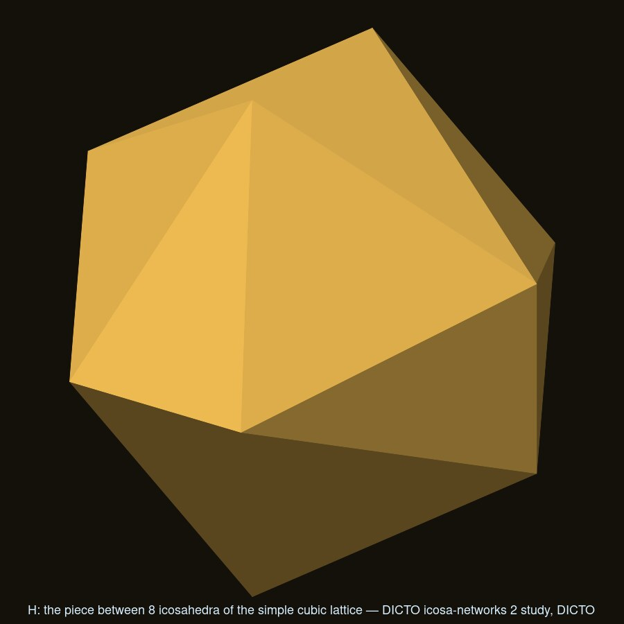 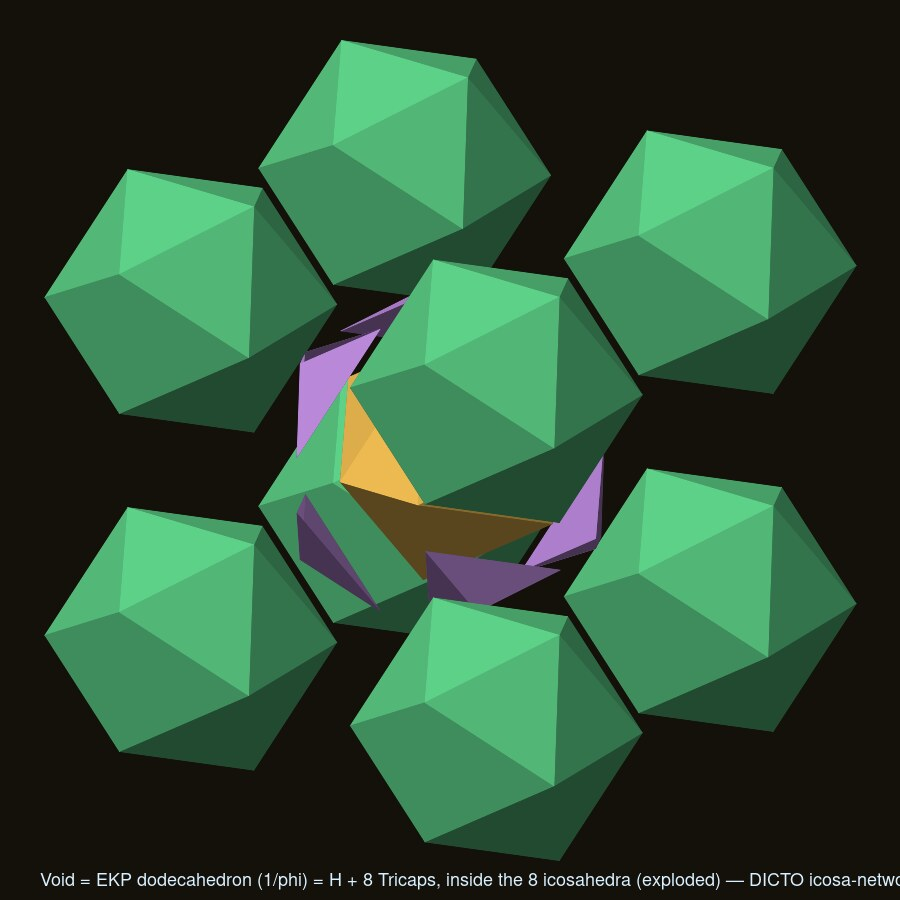
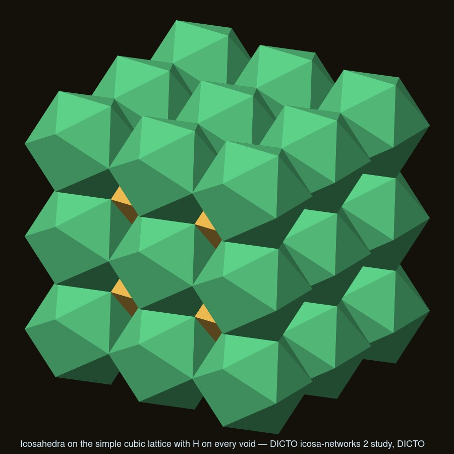 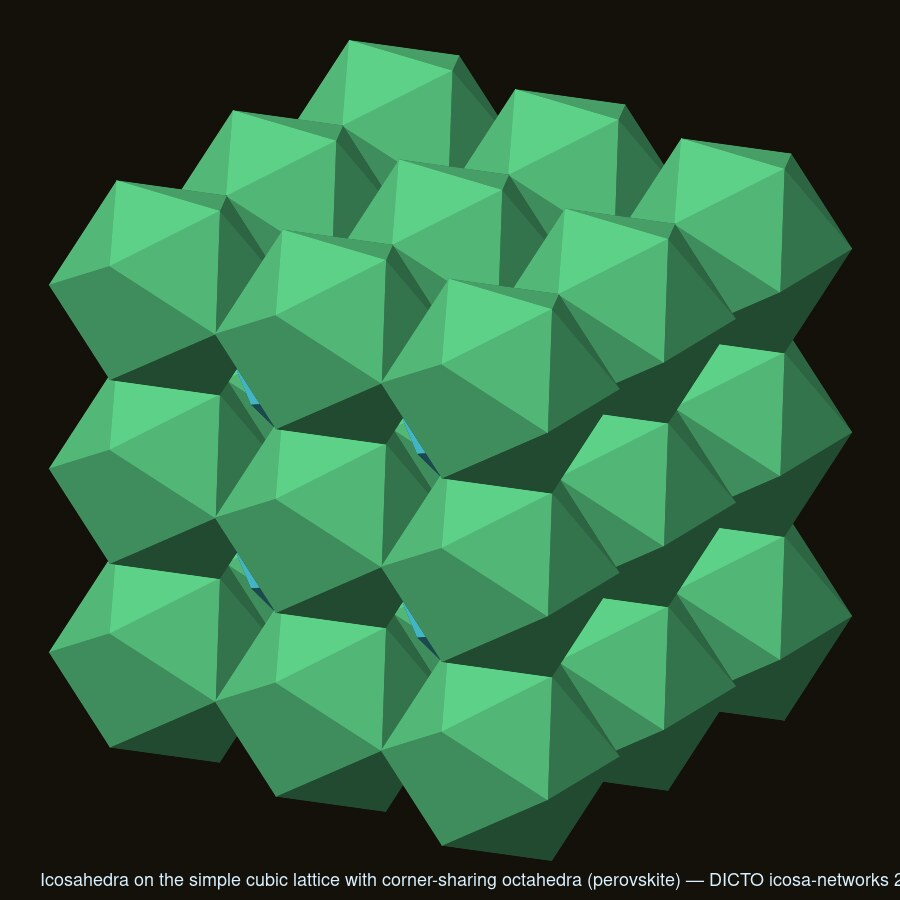
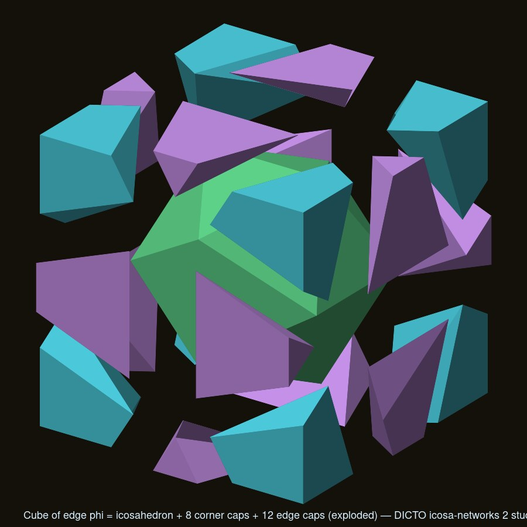

## 3. The octahedron as the icosahedron's EKP cell, and the octet filling

Euclid puts 6 roofs on a cube to make the dodecahedron. The icosahedron's version uses the octahedron:

- The octahedron of vertex radius φ²/2 (edge φ²/√2 = 1.851230) has the unit icosahedron's 12 vertices on its 12
  edges at the golden section (0.618034 of each edge), and 8 icosahedron faces lie in its 8 face planes (classical:
  the icosahedron inscribed in the octahedron).
- **Octahedron = icosahedron + 6 edge roofs** (`data/ico-roof`, `data/octahedron-ico-parts`). Each roof straddles
  one axial icosahedron edge (the short side of a Pacioli rectangle) and rises to the octahedron vertex: two
  tetrahedra sharing the triangle (apex, ridge), each with edges 1 ×3 (an icosahedron face), √2/2 ×2 and φ√2/2 ×1,
  dihedrals 41.81° ×2, 54.74° ×2, 109.47°, 110.91°, volume **φ/24 = (1 + √5)/48**. The roof is φ/12, the 6 roofs
  φ/2, and icosahedron + φ/2 = φ⁶/6 = (9 + 4√5)/6, the octahedron's volume (exact). The roof is concave along its
  ridge (221.81°), as a pentahedral roof is not; it is a roof over an edge, not over a face. Its √2 edges are the
  face diagonals of the cube frame, the same second rod family the EKP's stella octangula needs.
- **The EKP reflection.** Reflecting each apex through the plane of its ridge (at φ/2) gives 6 points at radius
  1/(2φ) = φ²/2 ÷ φ³: a regular **octahedron 1/φ³ the size**, inside the icosahedron. So octahedron ⊃ icosahedron ⊃
  octahedron/φ³ ⊃ icosahedron/φ³ ⊃ ..., with the quasicrystal inflation factor φ³ per round, like the Star Chain (#12).
  Unlike the EKP's reflection the small octahedron touches nothing, so this is a scale relation, not a lattice fold.
- **The octet filling** (`data/octet-ico-parts`). Octahedra on the fcc lattice (conventional cube φ²) with regular
  tetrahedra between them fill space (the octet truss). Put the icosahedron in every octahedron: **icosahedra +
  roofs + tetrahedra fill space** with no overlap (279 pieces, 0 overlapping pairs; a 24³ point grid over the cube
  finds every point in exactly one piece). Shares: icosahedra 48.63%, roofs 18.03%, tetrahedra 33.33%. Each
  tetrahedron face is exactly one whole icosahedron face plus three whole roof triangles (area 1.483957 = 0.433013 +
  3 × 0.350315), so every contact is whole or a dissection, closed by DICTO's rule. Each icosahedron touches 8
  tetrahedra on whole faces and each tetrahedron 4 icosahedra: the icosahedra and tetrahedra form the **fluorite
  (CaF₂) network**. All icosahedra are parallel, so the symmetry is Fm-3, the fcc version of the EKP's Pm-3.
- The 6 roofs meeting at one truss vertex make a **roof star** (`data/octet-roof-star`, volume φ/2, 36 faces); they
  touch only at the apex, so its Euler number is 7 (six pieces pinched at a point).

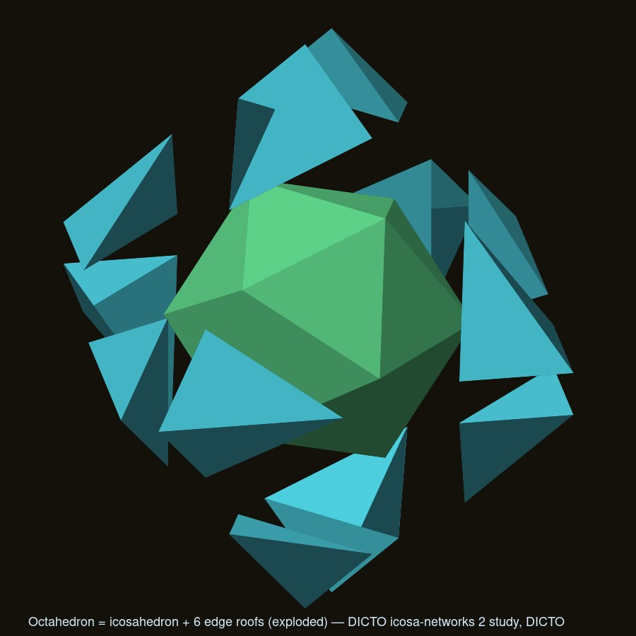 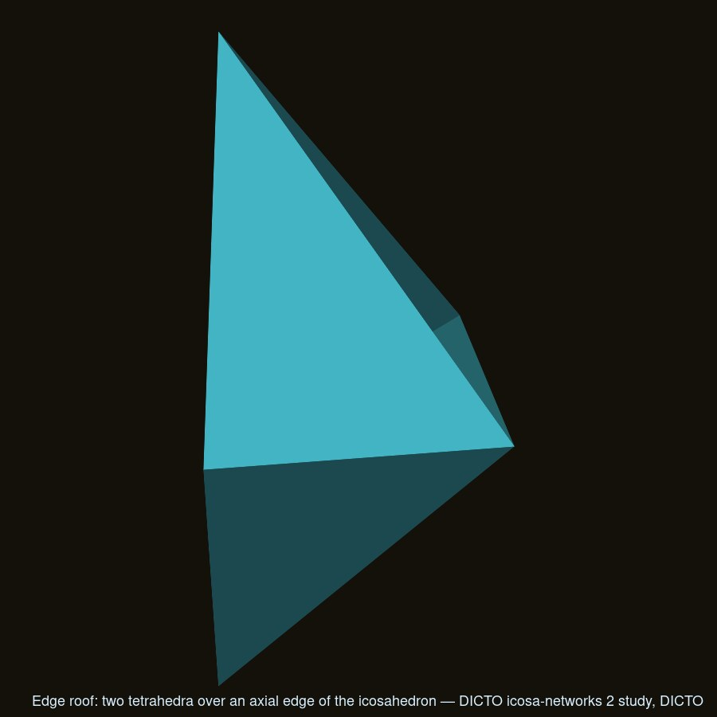
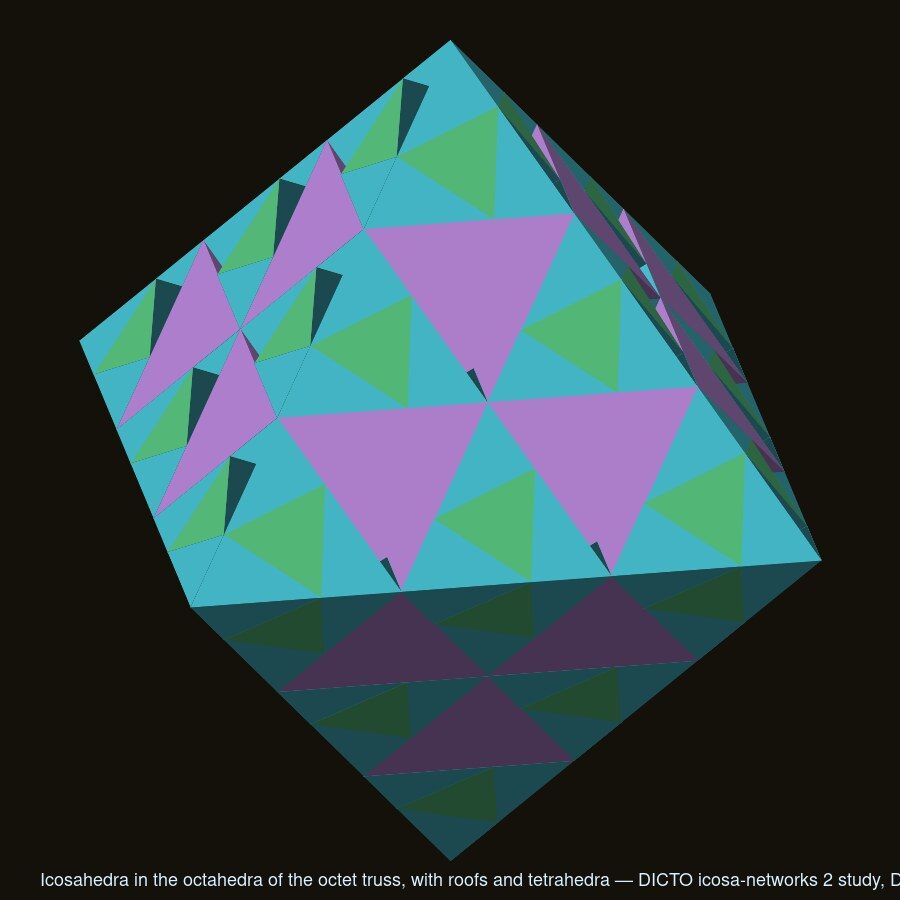 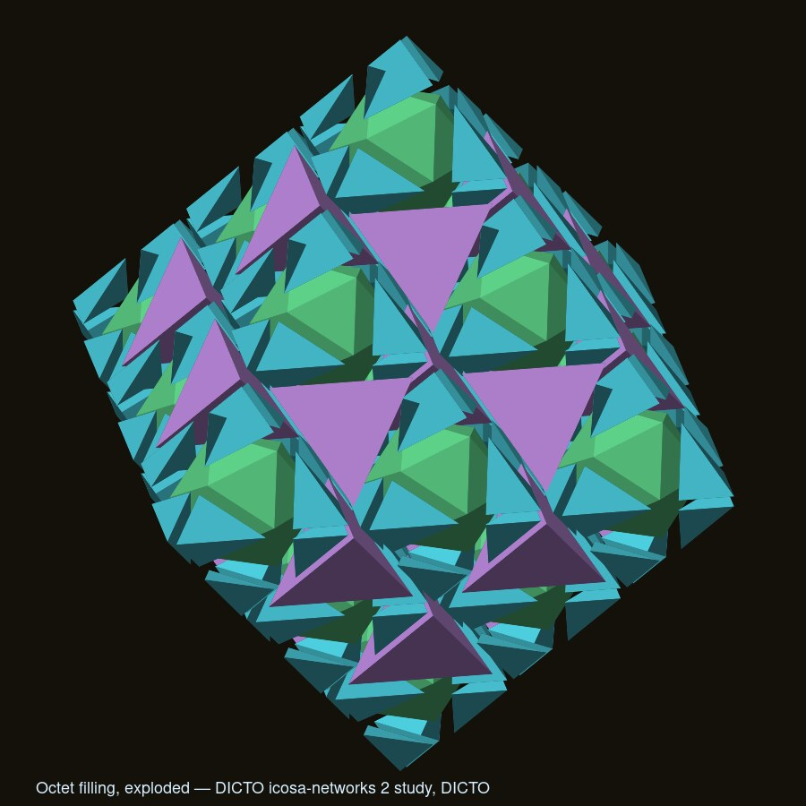 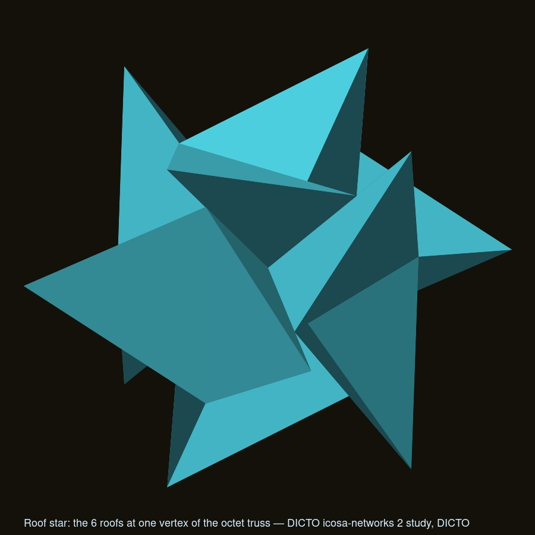

## 4. Bonds through Kepler Stars: what works and what clashes

The KEPLER MACE joins two Stella-Coronas through one Kepler Star with two spikes removed, along a five-fold axis,
period φ²D = 5.830447 (D = 2.227033, the pentagram plane distance). The second corona is a translate of the first.
Here a **node** is a corona with bonds on any subset of its 12 axes. Two modes: **bonds** (unbonded pentagrams bare)
and **diadem** (a full 11-spike Kepler Star on every unbonded pentagram, as in the Kepler Star Diadem).

| Test | bonds | diadem |
|---|---|---|
| one bond (the MACE) | clean | clean |
| two bonds at 63.43° (the two outer coronas 6.130459 apart on a two-fold axis) | clean | **44 overlaps** (the two Kepler Stars on the pentagrams at 31.72° from the two-fold line run into each other: 2 core–core, 20 core–spike, 22 spike–spike) |
| two bonds at 116.57° (outer coronas 9.919 apart) | clean | clean |
| two bonds at 180° (11.661 apart) | clean | clean |
| unbonded pair at the two-fold distance 6.130459 | clean | 44 overlaps |
| the 13-cluster: 12 bonds | **clean**, union closed, Euler 2, volume **(1605 + 650√5)/3 = 1019.481** | 1320 overlaps |
| prolate rhombohedron lattice, 3 × 3 × 3 block | **clean** | 1584 overlaps |

- Two bare coronas at the two-fold distance clear each other by (5 − √5)/10 = 0.276393: the corona's extent along a
  two-fold axis is (5 + 3√5)/4 = 2.927051, less than its vertex radius 3.077684.
- So the Kepler Star Diadem is a finished shell, not a node: wherever a corona has a two-fold neighbour (every
  pair of bonds at 63.43°), the two pentagrams facing that neighbour must stay bare. Only the MACE link repeats.
- The oblate rhombohedron (three bonds at 116.57°) has a short body diagonal of 0.562777 bonds = 3.281244, so the
  two coronas across it overlap: no oblate lattice, and in the Ammann–Kramer tiling one vertex of every oblate short
  diagonal must be left empty (§5).

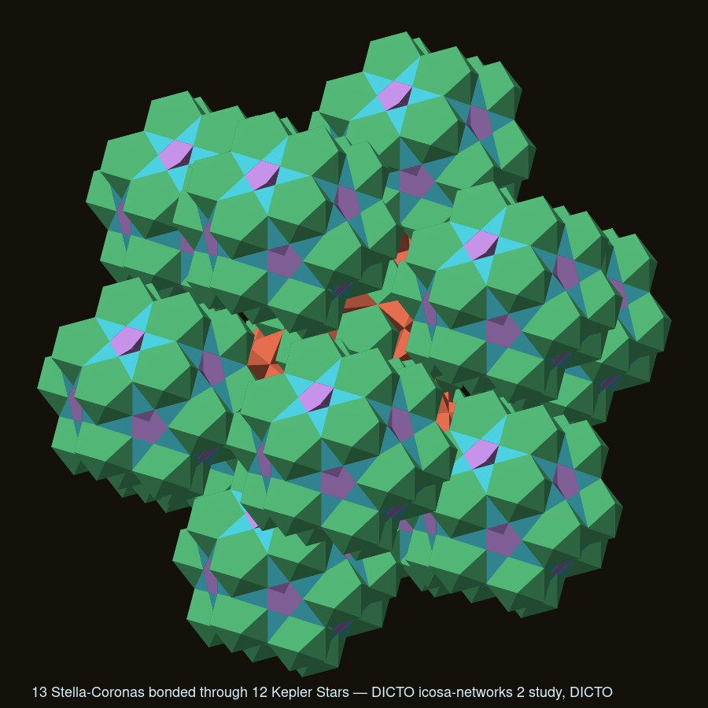 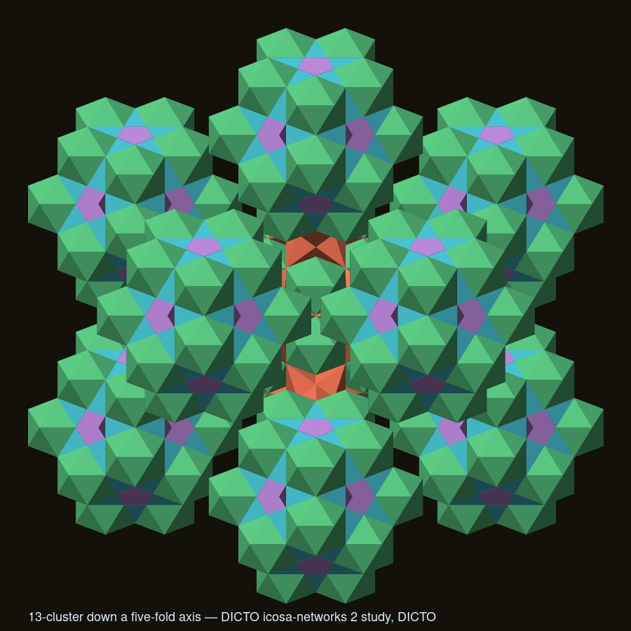

## 5. The MACE network: periodic and quasiperiodic

**13-cluster** (`data/mace-13-bonds`): one corona bonded through 12 Kepler Stars (10 spikes each) to 12 coronas on
its five-fold axes. 13 × 75.031732 + 12 × (3.858746 − 0.186339) = (1605 + 650√5)/3. Its 12 outer coronas are at the
two-fold distance from their 5 neighbours, so they stay bare towards each other; the cluster is the vertex star of
a 12-coordinated vertex of the tiling.

**Prolate lattice** (`data/mace-prolate-parts`): bonds along three mutually adjacent five-fold axes (63.43°) and
their opposites, 6 per node. The nodes form the lattice of the prolate golden rhombohedron, edge 5.830447, cell
150.800212 (a³√(1 − 3c² + 2c³), c = 1/√5); every non-bonded distance is at least 1.0515 bonds. Per node a corona
and three shared stars, 86.0490: **density 57.06%**. This is the #17 rule with n = 6: six corners, six neighbours, a
(sheared) simple cubic net, each shared Kepler Star in exactly two coronas.

**Cut-and-project patch** (`data/mace-quasi-bonds-parts`, sites in `data/mace-quasi-sites.json`). Vertices of the
icosahedral module: x = Σ nᵢ eᵢ with nᵢ ∈ ℤ, eᵢ the six five-fold vectors of length one bond, accepted when the
perpendicular image Σ nᵢ eᵢ⊥ (eᵢ⊥ = the Galois conjugate, τ → −1/τ, scaled by τ) lies in a window. Bonds along every
pair at exactly one five-fold step.

- With the **rhombic triacontahedron** window (the Ammann–Kramer vertex set, Kramer & Neri 1984): within 2.6 bonds
  of the centre, 183 vertices, and besides bonds (1) the distances 0.5628 (the oblate short diagonal, 6D difference
  (0,−1,−1,0,1,0)), 0.6498 ((0,−1,−1,1,1,0)), 1.0515, 1.1926, 1.4511, ... occur. Removing one vertex of each pair
  under one bond (101 of 183, greedy) leaves 82 coronas with 151 bonds, coordination 1 to 12: **0 overlaps**.
- With a **ball window of radius 1.19 perpendicular edges** (57.3% of the triacontahedron's volume; the largest
  ball that excludes both short vectors, whose perpendicular images are 2.3840 and 2.7528 long): within 3.4 bonds,
  **93 coronas, 192 bonds, coordination 2 (30), 4 (30), 6 (32), 12 (1), no pair under one bond, 0 overlaps** over
  23 037 convex parts. The non-bonded distances that occur are 1.0515 (120 pairs), 1.4511 and 1.7013, all tested
  clean by §4 and here.

So the same two pieces, the Stella-Corona and the Kepler Star with two spikes removed, make a periodic crystal
(the prolate lattice), a finite icosahedral cluster (the 13-cluster) and a quasiperiodic network (the model set),
with every bond along a five-fold axis and every bond the edge of a golden rhombohedron. This is the bridge DICTO
is after, built from his own pieces. It is a network, not a tiling: the gaps are labyrinths (§6).

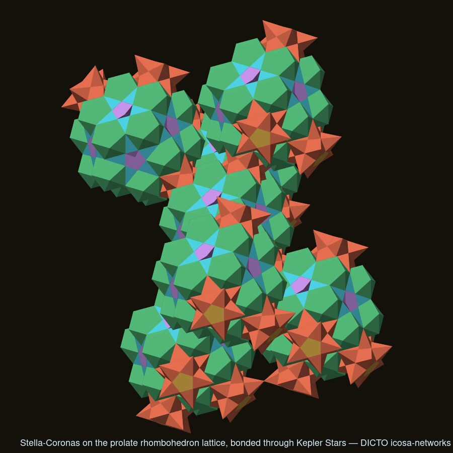 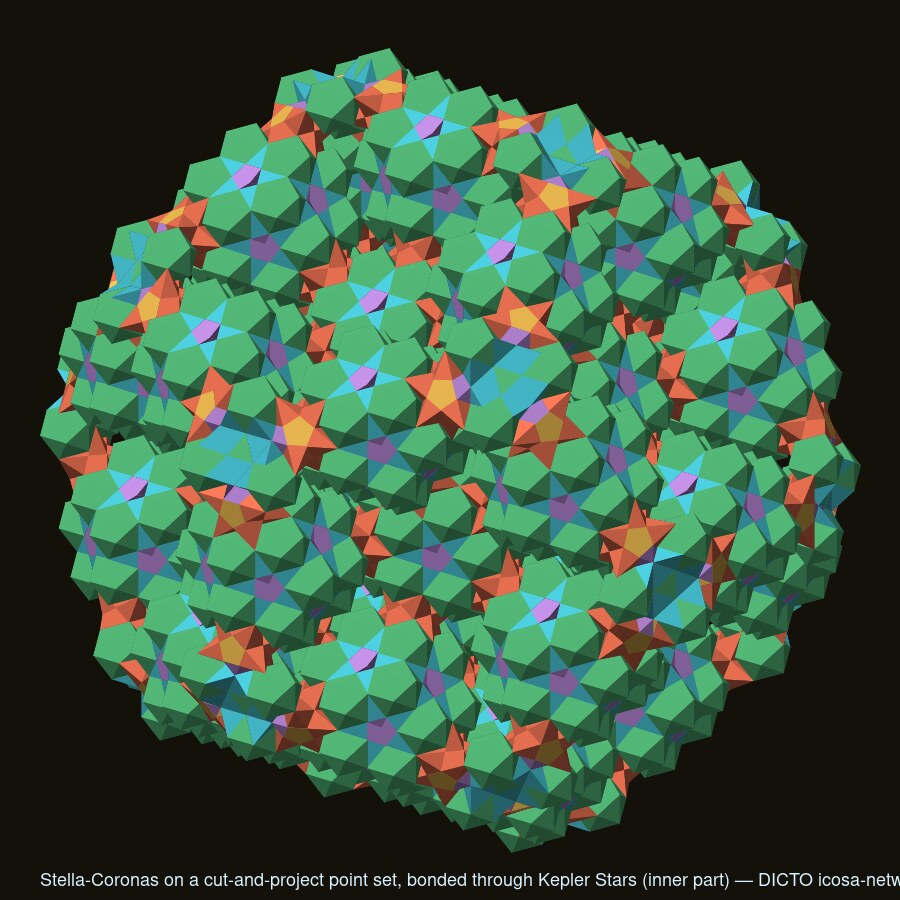
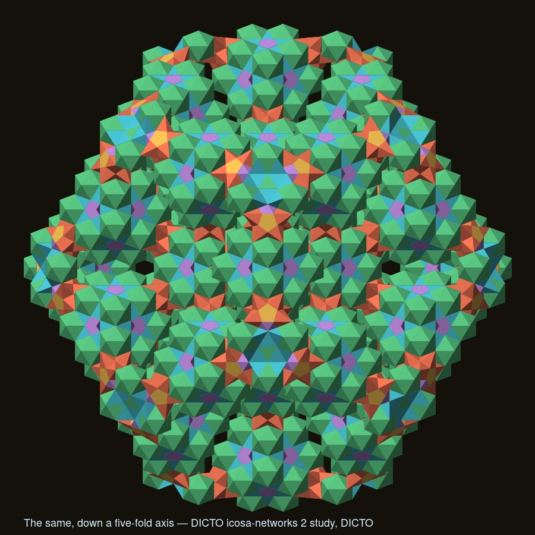

## 6. Clusters, hulls and gaps

- **Pyrochlore.** In the diamond network each Stella-Corona shares 4 icosahedra, at 2.267284 = √3 φ²/2 on a
  tetrahedron of 3-fold axes: a regular tetrahedron of edge φ²√2 = 3.702459. Each shared icosahedron is in exactly
  two coronas and has 6 nearest shared neighbours at 3.702459, the next shell at 6.413: the **pyrochlore lattice**
  (conventional cube 4φ² = 6 + 2√5 = 10.472136, nearest-neighbour distance cube·√2/4, matches). DICTO's Kagome
  hulls rule (#17) holds with n = 4: a tetrahedron of shared pieces, a diamond net of clusters.
- **No tetrahedral or octahedral clusters of coronas.** Sharing icosahedra, a corona can have neighbours only on
  axes at 109.47° or 180° (#20), so no three coronas are mutually bonded and no six close a ring round a hole as
  the Jewel and Sunstar clusters do. The MACE network has 4-rings (two bonds at 63.43° on each side) but every
  such ring's hole opens into the labyrinth.
- **Gaps** (`gap.mjs`, periodic voxel flood fill of one cell at 48³ and 72³, solid fractions matched to the exact
  ones within 0.3%): diamond network of Stella-Coronas, cell 287.108, solid 49.23%, gap **one labyrinth** (at 72³:
  145.93 of 145.96 in one component that wraps round the cell, the rest voxel slivers under 0.001); prolate MACE
  lattice, cell 150.800, solid 57.06%, gap **one labyrinth** (65.10 in one wrapping component). No sealed hole, so no partner piece and no even/odd regrouping; the octet and Kagome
  moves of #15 to #17 stop here, as #20 found for icosahedron packings.
- **Lotus seed, UNITY, Diadem clusters.** The Lotus seed is an icosahedron of edge φ², so §3 applies to it: Lotus
  seeds in the octahedra of an octet truss of cube φ⁴ = 6.854 fill space with their roofs and tetrahedra. UNITY has
  no clean sharing (#19). Diadems clash at the two-fold distance (§4).

## 7. Prior art (library first, then web, 2026-10-10)

- **H and the pseudoicosahedron.** Koca, Koca, Al-Mukhaini & Al-Qanobi 2015 (arXiv 1506.04600, in the library)
  derive the pseudoicosahedron (1 + x)e₁ + x e₂ (cyclic, signs) from the pyritohedral group, note that the
  dodecahedron's 12 non-cube vertices are one (that is H, x = 1/τ), and embed pseudoicosahedra with rational x in
  the simple cubic lattice along the Fibonacci sequence. **H as a solid is theirs**; H as the void of the simple
  cubic packing of regular icosahedra, its 8 whole-face contacts, the Tricap corners and the gap of exactly 1/2
  were not found. The Polytope Wiki lists the pyritohedral icosahedron as the hull of three orthogonal rectangles.
- **Edge-sharing icosahedra on a simple cubic net:** the Cs₈Sn₄₆ clathrate has edge-sharing Cs₁₂ icosahedra in a
  primitive cubic packing (RSC supplement b719615f); Dewar 2024 (Symmetry: Culture and Science 35(4)) builds open
  packings of edge-sharing icosahedra from pentagon tilings. Neither gives the void piece or the density.
- **Icosahedron in the octahedron** at the golden section: classical (Pacioli 1509 in the library; Kolar-Begović
  2017 proves it for affine regular solids). The 6 roofs as pieces, the φ³ reflection and the octet filling with
  roofs and tetrahedra were not found (search: icosahedra in octet-truss octahedra, golden octet truss).
- **Hart.** Virtual Polyhedra: 59 icosahedral stellations (Coxeter's order), "several thousand" tetrahedral
  stellations of the icosahedron, no space-filling or honeycomb remark on either page; Polyhedra Clusters: 12 small
  stellated dodecahedra tip to tip at an icosahedron's vertices (and 144 as a second-order fractal), 20 great
  icosahedra at a dodecahedron's vertices, 30 at an icosidodecahedron's. Finite clusters, tip contacts only. The
  Diadem's 12 Kepler Stars also meet tip to tip, but on a corona and with their cores at 2.915, not at the spike
  length, so the clusters differ; Hart's are the nearest relatives.
- **Cut-and-project:** Kramer & Neri 1984 and the model-set literature (Moody 2000, Baake 1999, in the library).
  The triacontahedral window gives the Ammann–Kramer vertex set; a ball window is a standard choice for cluster
  decorations. The decoration of such a point set with Stella-Coronas bonded by Kepler Stars was not found.
- Mosseri & Sadoc 1982 and Koca et al. 2020: the Tricap is tile t3. Kepler 1619: the small stellated dodecahedron.
- Not proof of novelty.

## 8. New shapes needing names (working labels)

| Working label | One line | Data |
|---|---|---|
| H | hull of the 12 shared vertices round a void of the simple cubic icosahedron lattice; 8 equilateral + 12 golden triangles, (3 + 7√5)/12; the EKP dodecahedron of edge 1/φ minus 8 Tricaps | `data/sc-star-H` |
| edge roof | two tetrahedra over an axial edge of the icosahedron, apex at the octahedron vertex, φ/12; six make the octahedron | `data/ico-roof` |
| roof star | the 6 roofs at one vertex of the octet truss, φ/2 | `data/octet-roof-star` |
| corner cap, edge cap | the cube of edge φ minus the icosahedron, 8 + 12 pieces | `data/pacioli-corner-cap`, `pacioli-edge-cap` |
| perovskite octahedron | octahedron of vertex radius φ/2 at the void, tip to tip with its neighbours | in `data/sc-perovskite-block-parts` |
| 13-cluster | a Stella-Corona bonded through 12 Kepler Stars to 12 coronas | `data/mace-13-bonds` |
| prolate MACE lattice | coronas on the prolate golden-rhombohedron lattice, 6 bonds each | `data/mace-prolate-parts` |
| MACE model set | coronas on a cut-and-project point set, bonded along every tiling edge | `data/mace-quasi-bonds-parts`, `mace-quasi-sites` |

## 9. Recommendation and questions for DICTO

Recommendation: keep the **MACE network** as the result of this study. It is the first structure in the family
that is at once a periodic lattice, an icosahedral cluster and a quasiperiodic model set from the same two pieces,
with every contact a whole face. For the apps: the 13-cluster and the prolate lattice as Kaleidohedra views (the
Kepler Stars drawn once, shared), the model-set patch as a third view if the renderer copes with 93 coronas; H,
the edge roof and the roof star as Polyhedraverse pieces; the sc lattice with H and the octet filling as Studies
views. The EKP echo (§2, §3) is a tidy closed result with exact numbers and one known solid (H) in a new place.

Questions:
1. Names for H, the edge roof, the roof star, the caps, the 13-cluster, the prolate MACE lattice and the model set?
2. In the MACE network the two pentagrams facing a two-fold neighbour stay bare. Leave them bare, or search for a
   shared piece between the two facing pentagrams (they are not coaxial, so it would be a new piece)?
3. Which window for the model set: the ball of radius 1.19 (no pruning, coordination 2 to 12), or the Ammann–Kramer
   vertex set with one vertex of each short pair removed (denser bonds, a pruning rule to choose)?
4. Should the simple cubic lattice with H be recorded as the icosahedral EKP cell (DISCOVERIES), with H credited to
   Koca et al. 2015 and the dodecahedron-minus-Tricaps reading as DICTO's?
5. Build the Lotus-seed octet filling (edge φ²) as well, or only the unit one?

## Files

`data/`: `sc-star-H`, `sc-rocksalt-parts` (8 icosahedra + H + the perovskite octahedron), `sc-rocksalt-block-parts`,
`sc-perovskite-block-parts`, `sc-void-dodecahedron-parts` (H + 8 Tricaps inside the 8 icosahedra),
`pacioli-cube-parts`, `pacioli-corner-cap`, `pacioli-edge-cap`, `ico-roof`, `octahedron-ico-parts`,
`octet-ico-parts`, `octet-roof-star`, `mace-13-bonds` (+ `-parts`), `mace-prolate-parts`, `mace-quasi-bonds-parts`,
`mace-quasi-sites`; each in unit and raw scale with the checks it passed. `renders/`: the JPGs above (icosahedra
green, icosidodecahedra, dodecahedra and H gold, AXE and roofs cyan, CLEO, Tricaps and tetrahedra purple, Kepler
spikes orange-red).
