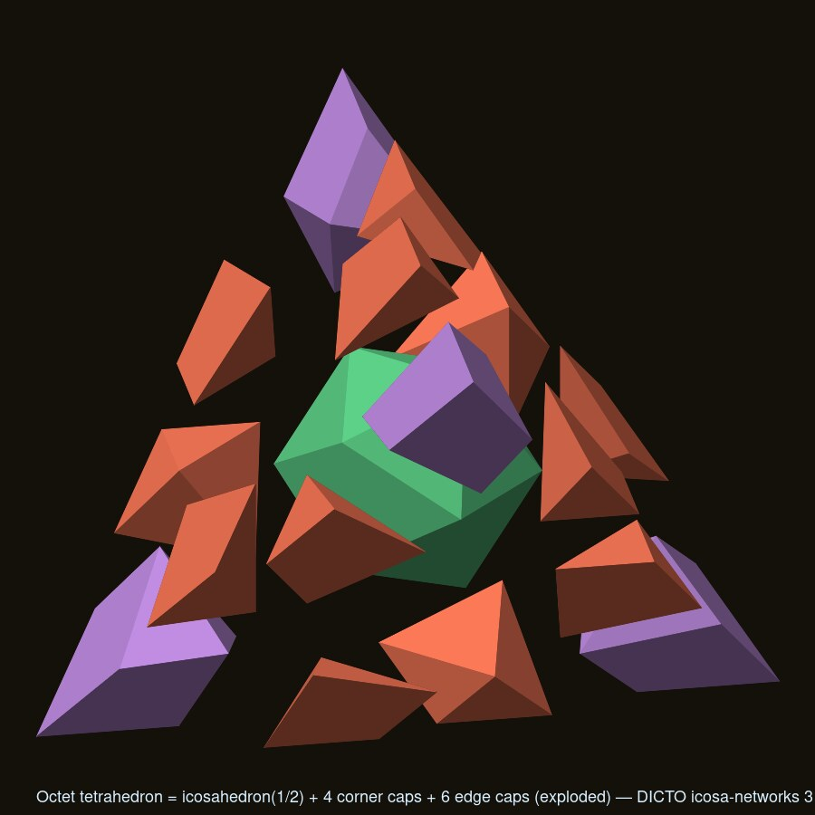
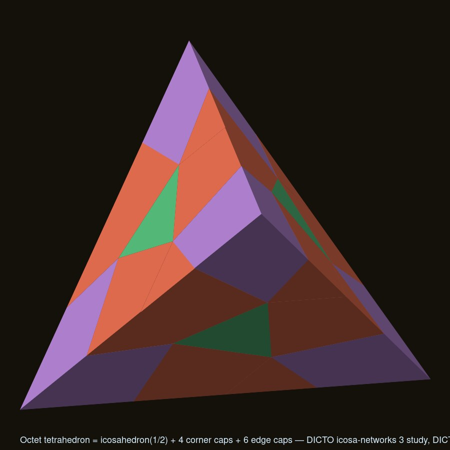
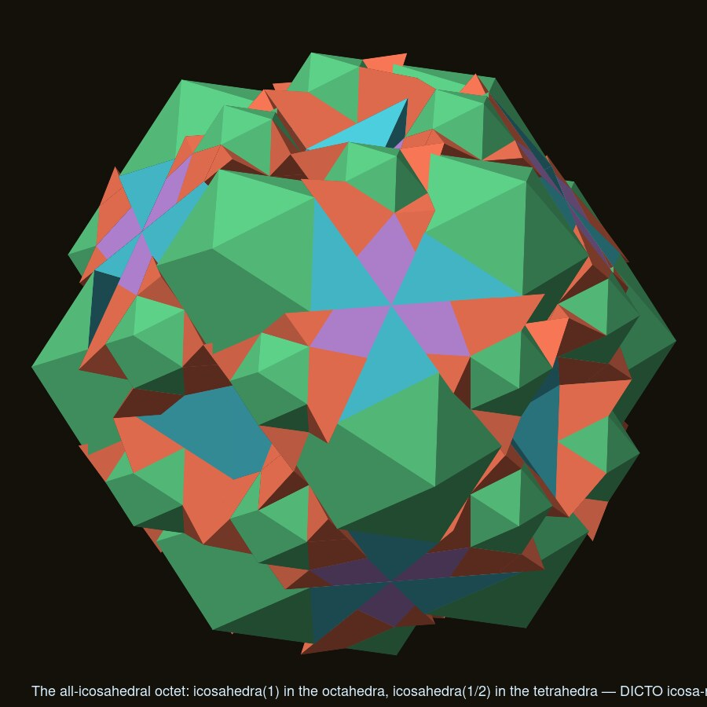
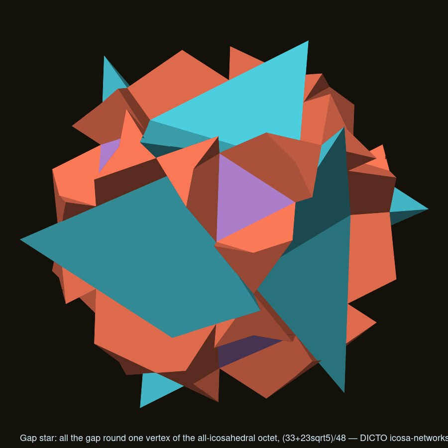
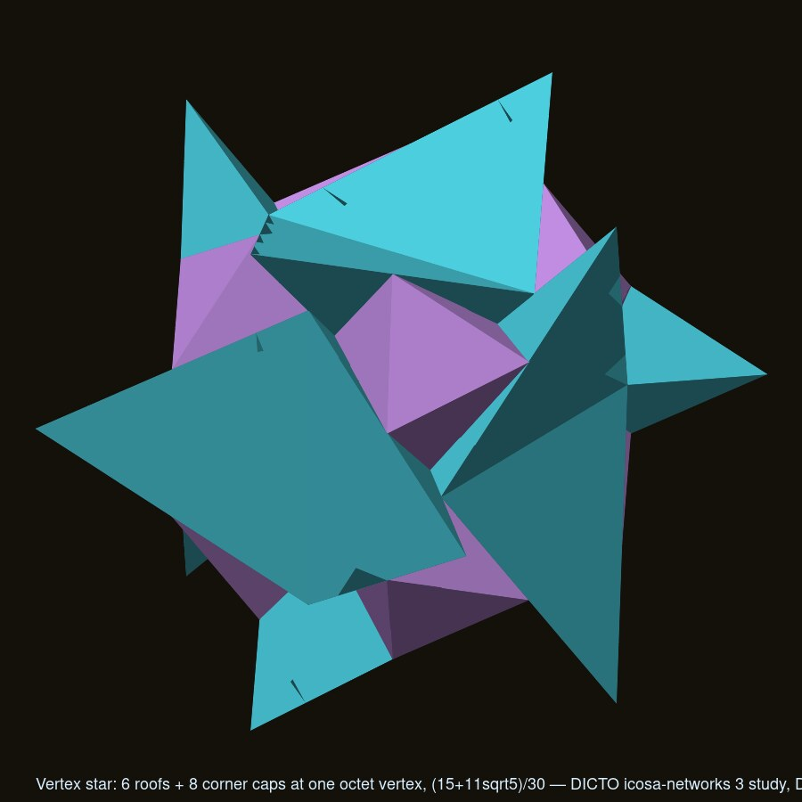
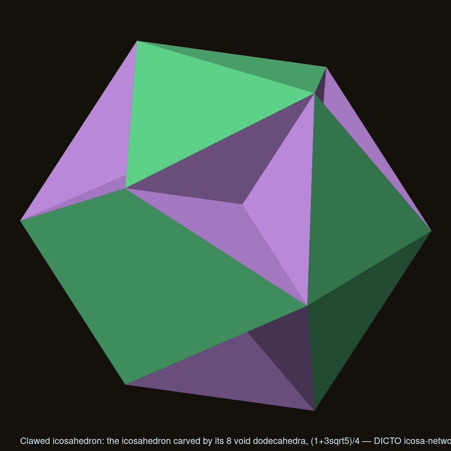
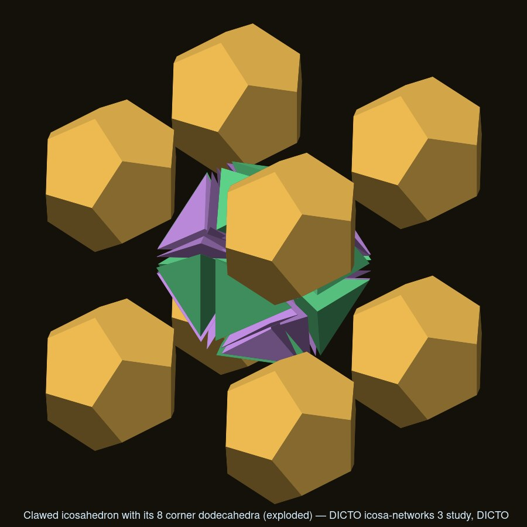
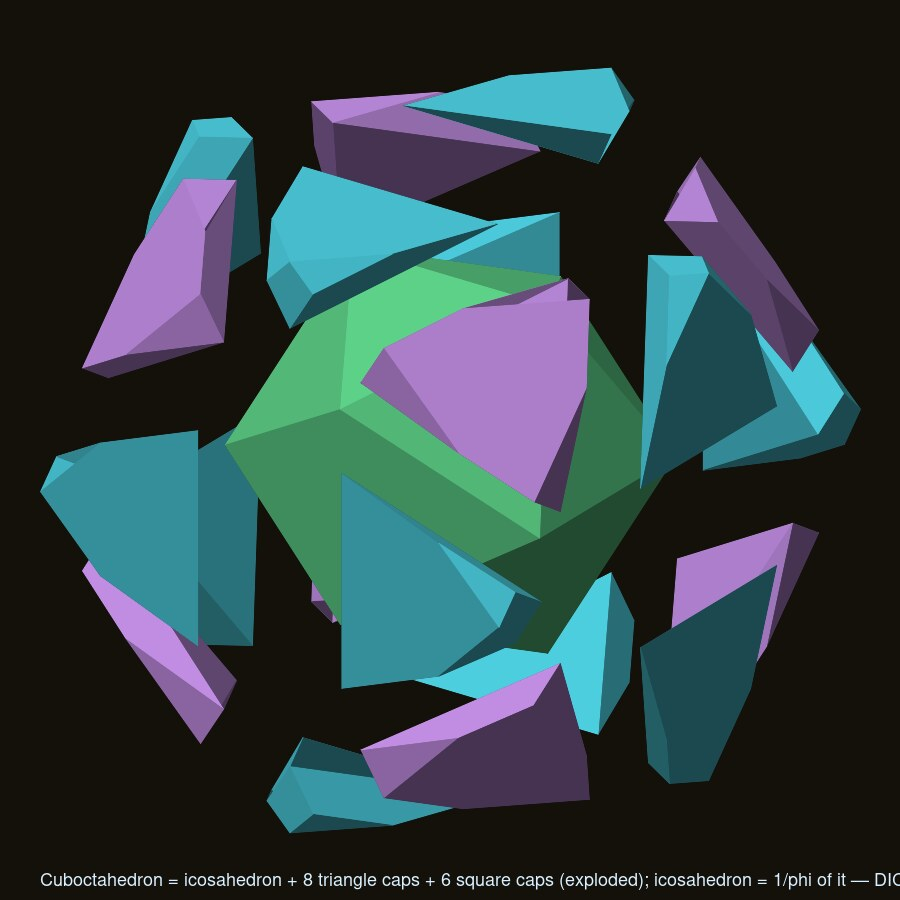

# DICTO icosahedral networks, part 3: the all-icosahedral octet and the Kagome family (design study, 2026-10-10)

Research only, no app changes. Credit: DICTO (design study, 2026-10-10), with Claude (Fable). DICTO's ask: "work
through all the possibly novel icosahedral networks, including the octahedron and Kagome style", and, top priority,
the **all-icosahedral octet**: since octahedron = icosahedron + 6 edge roofs (part 2, §3) leaves only regular
tetrahedra as gaps, make each tetrahedron "really an icosahedron" too, and see whether roofs and caps meet as whole
pieces, whether a sealed star (a Dogstar twin) appears, and what the Jewel-style carving gives.

Scale **unit** = icosahedron edge 1 (`data/*-unit.json`; `*-raw.json` = unit / (φ/2)). Checks as in parts 1 and 2:
closed, consistently wound, Euler 2, no overlap by separating axes over every pair of convex parts, exact golden
volumes, point tests over a cell. Scripts with the working copy: `octet-all.mjs` (§1, §2, §3; `octet.log`,
`results-octet.json`), `cells.mjs` (§4, §5; `cells.log`, `results-cells.json`), `quasi-diamond.mjs` (§6, ran on
dicto-node, 64 s; `quasi.log`, `results-quasi-diamond.json`), `render.mjs`, `render-all.sh`.

> **Filed 2026-10-10.** DICTO's decisions: record in DISCOVERIES (#21 the icosahedral octet; the 138.19° joint in
> #20); keep the 2 : 1 sizes; build the bent-chain and 3-connected Stella-Corona networks next. Names for the new
> shapes are still DICTO's to give. Research scripts stay with the study's working copy.

## Summary

| Item | Result |
|---|---|
| **All-icosahedral octet** (DICTO's priority) | **Built, closes exactly.** The tetrahedron's icosahedron has edge **1/2**, not a golden ratio: 2 : 1 to the octahedron's. Tetrahedron φ⁶/24 = icosahedron(1/2) (15+5√5)/96 + 4 corner caps (15+7√5)/480 + 6 edge caps (5+3√5)/320. 2021 parts, 0 overlaps, every grid point in one piece. Icosahedra fill **(175 − 75√5)/12 = 60.79%** of space (big 48.63%, small 12.16%). The small face is the **medial triangle** of the big face across every shared triangle (§1) |
| Roofs and caps as whole pieces | Across a shared triangle a roof meets 1 corner cap + 3 edge pieces, a corner cap meets 3 roofs; nothing matches whole to whole. The pieces at one vertex (6 roofs + 8 corner caps) are one face-connected solid, the **vertex star** (15+11√5)/30, but it is pinched along the 12 edges; with the edge caps halved at the edge midplanes the whole gap round a vertex is the **gap star**, closed, Euler 2, **(33+23√5)/48 = 1.758949**, one per fcc site (§2) |
| Dogstar twin (DICTO (a)) | **Impossible.** The gap is one labyrinth: the contact graph of all 332 gap pieces round a vertex is connected through the edge caps (858 face contacts). Gap stars tile space with the two icosahedra but touch each other across their 12 cut faces, so no star is sealed by icosahedra alone, as #20 found for all icosahedron packings (§2) |
| Carving, the Jewel move (DICTO (b)) | In the octet nothing overlaps, so there is nothing to carve. The carving lives in part 2's simple cubic lattice: the **clawed icosahedron** = icosahedron minus the 8 Tricaps its corner dodecahedra bite out, **(1+3√5)/4 = 1.927051** (88.33% = (6√5 − 9)/5 of the icosahedron), 36 faces: 12 icosahedron triangles + 8 windows of 3 obtuse golden triangles (1, 1/φ, 1/φ), each dent 0.220528 deep to the dodecahedron's cube corner. Tiles with the dodecahedra: 0 overlaps, gap exactly 1/2 per cell (§3) |
| Other "really an icosahedron" cells on corner-sharing nets | Octahedron on ReO₃ + cuboctahedra, tetrahedron on pyrochlore + truncated tetrahedra, cube on the bcc cube net, RD cells: all **known honeycombs regrouped** (rectified cubic, quarter cubic, cubic, octet); caps of corner-sharing cells only touch at points. New numbers only: icosahedron = **exactly 1/φ** of its cuboctahedron; the sc(φ) lattice is the rectified cubic honeycomb with cuboctahedra = icosahedron + 8 triangle caps (11−4√5)/24 + 6 square caps (7√5−13)/24 (§4) |
| Kagome with DICTO's clusters as nodes | **Sharing needs a centrally symmetric corner piece.** Icosahedra and Kepler Stars work (Stella-Corona: 4, the MACE: up to 12); J11, VAJRA and Kings are one-sided, so UNITY, Venus and DESHI have no corner-sharing net at all. Lotus seeds sharing a corner icosahedron overlap by (10+5√5)/6 = 9.02% of a seed (§5). **New:** two shared icosahedra at **138.19°** are clean (the neighbours are 1.868 bonds apart); the full list of clean bond sets at a corona is 4 (tetrahedral), 3 (109.47³ or 109.47²·138.19), 2 (109.47, 138.19 or 180) (§5) |
| Quasiperiodic 3-fold-bonded corona network | **Impossible as a connected network with a ball window.** Every ball window with 0.2814 ≤ r < **0.324920 = (278√5 − 427)/599** perp edges is clean (proved by finite local complexity over 27 210 difference vectors, 204 865 separating-axis tests), but the limit is set by the 70.53° pair (neighbours at 1.1547 bonds), and a 109.47° pair needs r ≥ 0.4595, a chain r ≥ 0.5628: in the clean window 59.5% of coronas have no bond, 33.5% one, 7.0% two at 138.19°; mean 0.475, solid fraction 19.09%. The MACE (part 2) stays the only quasiperiodic corona network (§6) |

## 1. The all-icosahedral octet

Octahedra of edge L = φ²/√2 = 1.851230 on the fcc lattice (conventional cube φ²) with regular tetrahedra of the same
edge between them. Each octahedron = unit icosahedron + 6 edge roofs (part 2, §3). Each tetrahedron:

- Its inradius is L/(2√6) = 0.377881 = half the unit icosahedron's inradius φ²/(2√3), so the icosahedron whose 4
  alternate faces lie on the tetrahedron's faces has **edge 1/2**. All 12 vertices lie on the tetrahedron's surface,
  3 per face, none on an edge. Ratio to the octahedron's icosahedron **2 : 1** (not golden; the golden numbers are in
  the volumes). Icosahedron(1/2) fills 36.475% of its tetrahedron, as the unit one fills 72.949% of its octahedron.
- Across every shared triangle the small face (edge 1/2) is exactly the **medial triangle** of the big face (edge 1),
  inverted inside it (`octet.log`). So the big face is covered by one small icosahedron face and three corner
  sub-triangles that the small cell's caps cover: closed by DICTO's rule.
- **Tetrahedron = icosahedron(1/2) + 4 corner caps + 6 edge caps** (`data/tet-ico-parts`, `tet-corner-cap`,
  `tet-edge-cap`), by the same cone dissection as Pacioli's cube: corner cap (15+7√5)/480 = 0.063859 (7 vertices,
  edges √15/10 ×3, 1/2 ×3, 0.511667 ×6, dihedrals 70.53°, 90°, 110.91°, 125.26°); edge cap = two pieces of
  (5+3√5)/640 straddling one axial edge of the small icosahedron, (5+3√5)/320 = 0.036588 together, 8 faces, closed,
  reaching a middle segment of the tetrahedron's edge (never its ends). (15+5√5)/96 + 4·(15+7√5)/480 + 6·(5+3√5)/320
  = (9+4√5)/24 = φ⁶/24 exactly; 0 overlaps among the 17 parts.
- **The filling** (`data/octet-all-ico-parts`, block of 43 fcc sites, 2021 parts): 0 overlapping pairs; a 30³ point
  grid over the conventional cube finds every point in a piece (the 432 double counts are grid points on shared
  faces). Exact shares: big icosahedra 48.633%, small 12.158%, roofs 18.034%, corner caps 11.387%, edge caps
  9.788%. **Icosahedra: (175 − 75√5)/12 = 60.791%.** The big icosahedra are on fcc, the small on the diamond lattice
  of tetrahedron centres (the fluorite pattern of part 2 again, now both sites icosahedra). Symmetry Fm-3, all
  icosahedra parallel.

  

## 2. How roofs and caps meet; the vertex star and the gap star; no sealed hole

Face contacts (coplanar, opposite normals, positive overlap area) among the 332 gap pieces near one octet vertex:
858, by kind roof–corner cap 192, roof–edge cap 408, corner cap–edge cap 136, edge cap–edge cap 68, roof–roof 54
(the last are the two tetrahedra of one roof on their ridge triangle, area 1/4).

- One roof tetrahedron touches, across each of its two outer triangles (area 0.350315 each), one corner cap
  (0.205078) and three edge pieces (0.063373, 0.048412, 0.033452): no two pieces of neighbouring cells share a whole
  face, so nothing merges into a Euclid-style whole roof. The two edge caps on one octet edge (from the two
  tetrahedra) share only the edge line. The two big icosahedra on an edge put their vertices at 0.381966 and 0.618034
  of it (the two golden sections), so they do not meet there.
- **Vertex star** (working label, `data/octet-vertex-star`): the 6 roofs + 8 corner caps at one vertex are one
  face-connected solid (each corner cap touches 3 roofs, each roof 4 corner caps; the vertex itself is interior),
  volume **6·φ/12 + 8·(15+7√5)/480 = (15+11√5)/30 = 1.319892**, but its surface is pinched along the 12 octet edges
  where pairs of corner caps meet edge to edge, so it is not a manifold solid.
- **Gap star** (working label, `data/octet-gap-star`): all the gap nearest one vertex, the vertex star plus the 24
  edge caps halved at the edge midplanes (48 halves): refined into 3032 convex cells for an exact surface, 1688
  faces, **closed, Euler 2, volume (33+23√5)/48 = 1.758949** = φ⁶/4 − (5/4)·V_ico exactly. One per fcc site: big
  icosahedra + small icosahedra + gap stars fill space. But the stars touch each other across the 12 cut faces.
- **No Dogstar twin (DICTO (a)).** The contact graph of all gap pieces near the vertex is one component: the gap
  round a vertex is joined to the gaps round its 12 neighbours through the edge caps along every octet edge, so the
  gap is one labyrinth and no dissection of it has a piece sealed by icosahedra alone. This is #20's result for the
  packings, now for the all-icosahedral octet with its exact pieces.

 

## 3. The carving (DICTO (b)): the clawed icosahedron

The Jewel is the EKP dodecahedron carved by its face-neighbours' stellas (#10). In the octet nothing overlaps
(0 overlapping pairs above), so the move carves nothing. The overlap that does exist is part 2's: in the simple cubic
lattice (parameter φ) the void dodecahedron of edge 1/φ at every cube corner bites the 8 icosahedra round it, each
bite a Tricap (3−√5)/24 whose apex is the dodecahedron's cube corner, 0.535233 from the icosahedron's centre and
0.220528 below its corner face.

- **Clawed icosahedron** (working label, `data/clawed-icosahedron`): the icosahedron minus its 8 Tricaps. 36 faces:
  the 12 edge faces untouched and 8 triangular **windows**, each a dent of three obtuse golden triangles (1, 1/φ, 1/φ,
  the gnomon) meeting at the dodecahedron's corner, 37.38° to the old face plane along each icosahedron edge. Closed,
  Euler 2, volume **(1+3√5)/4 = 1.927051 = (6√5 − 9)/5 = 88.33%** of the icosahedron.
- **It tiles with the carvers:** clawed icosahedra on the sc lattice + whole dodecahedra (5+√5)/4 on the voids: 0
  overlapping pairs in a 3×3×3 block, point test 30³ every point in at most one piece; per cell clawed 45.49% +
  dodecahedron 42.71% + gap exactly 1/2 (11.80%). So part 2's "icosahedron + H + gap" and "clawed icosahedron +
  dodecahedron + gap" are the two readings of one lattice, as "dodecahedron + stella" and "Jewel + stella" are of the
  EKP's. The windows here are triangles (the dents), not rhombi: the icosahedral Jewel has 8 claws, the dodecahedral
  one 12.

 

## 4. The other cells on the corner-sharing nets (all known honeycombs)

| Cell = icosahedron + caps | Net (#17 rule) | Partner piece | Status |
|---|---|---|---|
| octahedron (ico + 6 roofs), cube φ² | ReO₃/perovskite, tip to tip, 6 neighbours | cuboctahedron of edge L, 5/6 of the cell | rectified cubic honeycomb, **known**; icosahedra 12.16% of space; roofs meet tip to tip only |
| tetrahedron (ico(1/2) + 10 caps) | pyrochlore, 4 neighbours | truncated tetrahedron of edge L, 1 : 1 with the tetrahedra, 23/24 of space | quarter cubic honeycomb, **known**; icosahedra 1.52% of space |
| cube φ (Pacioli, ico + 20 caps) | bcc cube net, 8 neighbours | the 6 other cubes of the doubled cell | one quarter of part 2's sc lattice, nothing new |
| cuboctahedron, vertices (±φ/2, ±φ/2, 0) cyclic | the #17 cuboctahedral net = the even sites of the sc(φ) lattice, 12 neighbours | the odd cuboctahedra and the perovskite octahedra (2+√5)/6 | rectified cubic honeycomb again, **known** |
| rhombic dodecahedron, 4-fold vertices at φ²/2 (the fcc Voronoi cell of the octet) | RD honeycomb (face to face), or the #17 bcc net | octet regrouped | **known** |

Numbers worth keeping (`cells.log`): the cuboctahedron holds the icosahedron with 2 vertices on each square (its
axial edge is the middle of the square's diagonal) and **icosahedron / cuboctahedron = 1/φ exactly** (5φ²/6 over
5φ³/6); cuboctahedron = icosahedron + 8 triangle caps (11−4√5)/24 (9 vertices, one hexagon) + 6 square caps
(7√5−13)/24 (two pieces each); per sc cell icosahedron 51.50% + octahedron 16.67% + triangle caps 16.18% + square
caps 15.65%. The RD holds the icosahedron with one vertex on each rhombus at the golden section of its long diagonal
(an octahedron edge); its cone dissection gives 8 corner pieces (9+5√5)/192 and 12 edge pieces (5+3√5)/96, and it is
also icosahedron + 6 roofs + 8 quarter tetrahedra φ⁶/96. The corner-sharing nets never merge the caps of neighbouring
cells: cells touch at points, and the partner pieces are the standard ones.

## 5. Kagome style with DICTO's clusters as nodes

- **Rule found:** a shared corner piece must be centrally symmetric, because the neighbour is a translate and sees the
  piece from the other side. Icosahedra (Stella-Corona, Lotus seed) and Kepler Stars (MACE) qualify; **J11, VAJRA
  and the King of Pentacles do not** (pentagon one side, decagon, triangle or pentagram the other), so **UNITY, Venus
  and DESHI have no corner-sharing network at all**, only tip-to-tip contact nets, which are Hart-style clusters, not
  Kagome. (#19 found the same for UNITY by test.)
- **Lotus seed** (I(φ²)): two seeds sharing a corner icosahedron (centres 2φ × vertex radius = 3.077684 apart on a
  5-fold axis) overlap in a 10-faced lens of (10+5√5)/6 = 3.530057, 9.02% of a seed, of which the shared unit
  icosahedron is 5.57%: a covering, as the Icosa-13 study said. 12 corners, no clean neighbour: coordination 0.
- **Stella-Corona** (20 icosahedra on 3-fold axes): all clean bond sets at one corona, by pair tests over the 20
  directions (41.81° and 70.53° pairs clash, the neighbours being 0.714 and 1.155 bonds apart, under the overlap range
  1.357; 109.47°, 138.19° and 180° are clean, neighbours at 1.633, 1.868 and 2 bonds): **10 sets of 4** (the
  tetrahedral frames: the diamond network), **40 triples at 109.47°**, **60 triples at 109.47°/109.47°/138.19°**,
  pairs at 109.47° (60), **138.19° (30)** and 180° (10, the chain). The 138.19° option was not in #20's statement:
  bent chains and 3-connected periodic nets with one 138.19° angle are new possibilities (not built here).
- **MACE nodes** (Kepler Stars shared on 5-fold axes): coordination 1 to 12, done in part 2 (§4, §5, §10).

## 6. The quasiperiodic 3-fold-bonded corona network (item 3)

Sites x(n), n ∈ ℤ⁶, kept when the perpendicular image lies in a ball of radius r (perp edges); a corona at every site;
a bond (one shared icosahedron) wherever two sites differ by one of the 20 three-fold vectors (sums of three mutually
adjacent five-fold vectors; |x| = 2.383963 five-fold steps, perp 0.562777). The 3-fold vector is scaled to the bond
4.534568, so the five-fold step is 1.902113 and the two-fold vector 2φ. The corona's 20 axes coincide with the 20
vectors. Finite local complexity as in part 2 §10, but with coronas only, so every configuration is a pair: all
27 210 difference vectors under 2 R_corona = 6.1554, in 209 classes by (|x|, |y|), one separating-axis census per
class (204 865 tests, `quasi.log`).

- The 3-fold bond is clean (1 shared piece). Everything shorter is a clash: the five-fold step (0.4195 bonds), the
  two-fold vector (0.4411), and the **70.53° pair difference 1.154701 bonds, perp 0.649839**, which is the smallest
  perp image among clashes; the 1.1864-bond class and most classes above 1.19 are clean.
- So **every ball window with 0.281389 ≤ r < 0.324920 = (278√5 − 427)/599 gives a clean infinite network**, and none
  larger. In it a corona has two bonds only at 138.19° (enclosing radius 0.3012); 109.47° needs 0.4595, 70.53° 0.3446
  (the clash), 41.81° 0.5257, a chain 0.5628. With r = 0.3229: coordination 0: 59.50%, 1: 33.49%, 2: 7.00%, mean
  0.4749 (exact 20·lens/vol); volume per corona 390.33; solid fraction 19.09% (the diamond crystal: 49.23%). A patch
  within 2.2 bonds has 13 coronas and 0 bonds. Not a network: the result is **impossible** for the natural window,
  (whether some non-ball window could hold a 109.47° pair while excluding every 70.53° clash is not settled; a
  thin, specially shaped window could admit one tetrahedral pair at the price of density, not a structure worth
  building). The MACE network (5-fold bonds through Kepler Stars) remains the only quasiperiodic corona network.

## 7. Prior art (library first, then one web search, 2026-10-10)

- Library (`~/Documents/kaleidohedra-references`): nothing on icosahedra in octet cells; Koca et al. 2015 is the
  nearest (pyritohedral icosahedra in cubic lattices).
- Known and credited: the icosahedron in the octahedron at the golden section (Pacioli 1509); the octet truss
  (Fuller); the rectified cubic (octahedra + cuboctahedra) and quarter cubic (tetrahedra + truncated tetrahedra)
  honeycombs; ReO₃/perovskite and pyrochlore nets; the fcc Voronoi RD. Web (2026-10-10, one search): the octet truss
  and Torquato's tetrahedron–octahedron tilings, a Wolfram "golden octet truss" module, Fuller-type icosahedral
  truss patents; **no icosahedron inscribed in the tetrahedron with 4 faces coplanar, no octet with icosahedra in
  every cell, no clawed icosahedron found.** Not proof of novelty; the icosahedron-in-tetrahedron (edge 1/2) is
  elementary and may be in older polyhedra literature.

## 8. New shapes needing names (working labels)

| Working label | One line | Data |
|---|---|---|
| tetrahedral corner cap | the octet tetrahedron beyond one corner face of its icosahedron(1/2), (15+7√5)/480 | `data/tet-corner-cap` |
| tetrahedral edge cap | two pieces over one axial edge of the icosahedron(1/2), to the tetrahedron's edge, (5+3√5)/320 | `data/tet-edge-cap` |
| vertex star | 6 roofs + 8 corner caps at one octet vertex, (15+11√5)/30, pinched on 12 edges | `data/octet-vertex-star` |
| gap star | all the gap nearest one vertex, closed, (33+23√5)/48, one per fcc site | `data/octet-gap-star` |
| clawed icosahedron | the icosahedron minus 8 Tricaps, 8 triangular windows, (1+3√5)/4 | `data/clawed-icosahedron` |
| triangle cap, square cap (cuboctahedron) | (11−4√5)/24 and (7√5−13)/24 | `data/cubocta-triangle-cap`, in `cubocta-ico-parts` |

## 9. Recommendation and questions for DICTO

The all-icosahedral octet is the result to keep: one principle (a Platonic cell holds an icosahedron, the rest is
roofs and caps) applied to both octet cells, closing exactly with icosahedra of edge 1 and 1/2 at 60.79% of space;
the gap star is its one gap piece; the clawed icosahedron is the Jewel's icosahedral twin. For the apps: the
tetrahedral cell exploded and the octet block as Kaleidohedra views, the gap star and the clawed icosahedron as
Polyhedraverse pieces.

1. Names for the gap star, the vertex star, the clawed icosahedron and the two tetrahedral caps?
2. The 2 : 1 size ratio: keep both icosahedra, or scale the tetrahedral one up (it then pokes out: the cell is fixed)?
3. The 138.19° bond is clean: build the bent chain and a 3-connected net (109.47°/109.47°/138.19°) of Stella-Coronas?
4. Record the clawed icosahedron and the all-icosahedral octet in DISCOVERIES (with Koca 2015 and the classical
   inscriptions credited)?

## Files

`data/`: `tet-ico-parts`, `tet-corner-cap`, `tet-edge-cap`, `octet-all-ico-parts`, `octet-vertex-star`, `octet-gap-star`,
`clawed-icosahedron`, `sc-clawed-parts`, `cubocta-ico-parts`, `cubocta-triangle-cap` (unit and raw), `quasi-diamond-sites.json`
(the 13-site patch and window). `renders/`: the JPGs above (icosahedra green, small icosahedra light green, roofs and
corner caps cyan/purple, edge caps orange, dodecahedra gold, windows purple).
