# DICTO icosahedral networks (design study, 2026-10-10)

Research only, no app changes. Credit: DICTO (design study, 2026-10-10), with Claude (Fable). DICTO's
question: "Research Hart and DICTO style networks for icosahedra, echoing dodecahedral structures using
relevant pieces from Icosa-13 construction or similar."

Scale **unit** = icosahedron edge 1 (`data/*-unit.json`; `*-raw.json` = unit / (φ/2), the EKP frame).
Names are DICTO's (AXE, FUJI, CLEO, Hasu, Lotus seed, DESHI, UNITY, Inner Eye from the Icosa-13). He named this
study's shapes on 2026-10-10 after seeing them in 3D; the sections below keep the working labels:

| Working label | DICTO's name |
|---|---|
| crown star (closed) | **DICTO Stella-Corona** |
| icosidodecahedron + 20 icosahedra (bare) | **12-Star voids** |
| crown (J2 + 5 AXE + 5 CLEO) | **HMV (Gramophone)** |
| pentagonal cup | **Five of Cups (Tarot)** |
| pentagram crown | **King of Pentacles (Tarot)** |
| UNITY + 20 cups | **Venus (Fly Trap)** |
| UNITY cup | **VAJRA** | Prior art: AXE and CLEO are the Mosseri–Sadoc tiles t6 and
t4 scaled by 1/τ (Mosseri & Sadoc 1982; Koca, Koc, Koca & Al-Siyabi 2020, arXiv 2009.07048).

Research scripts (kept with the study's working copy, not in the repo): `star.mjs` (§1–§3, §7), `j11.mjs` (§4),
`lattice.mjs` (§5, §6), `render-ico.mjs`, with logs `star.log`, `lattice.log` and the `results-*.json` numbers.

Every solid was checked as in the Icosa-13: closed (every edge in two faces), consistently wound, Euler 2,
no overlap by separating axes over every pair of convex pieces, volumes in exact golden form, repeated
pieces congruent by edge multiset and volume.

## Summary: each dodecahedral structure and its icosahedral echo

| Dodecahedral structure | Icosahedral echo | Result |
|---|---|---|
| DICTO-Star (#14): icosidodecahedron + 12 dodecahedra + 20 J63, closed | **Crown star** (working label): icosidodecahedron + 20 icosahedra on its triangles + 12 **pentagram crowns** on its pentagons | **Built.** Closed, Euler 2, volume (120 + 47√5)/3 = 75.031732. 33 pieces, every contact a whole face. The crown is J2 + 5 AXE + 5 CLEO + J2(1/φ) + 5 AXE, all Icosa-13 pieces. Outer surface: 200 icosahedron triangles and 12 flat pentagrams (§2) |
| UNITY's 20 dimples at 116.57° (DICTO's lead) | a dodecahedron or Dogstar-like piece in the dimple | **Impossible with regular faces** (§1). The 116.57° sits between two triangles, not two pentagons. The three walls' apexes are (5 + 3√5)/10 = 1.170820 apart, so no regular-faced cap. The convex **UNITY cup** (working label) closes each dimple to its rim: UNITY + 20 cups is closed, volume (735 + 301√5)/30 |
| Dodeca-13 star12 network, column, bcc (#13, #17) | crown-star networks | **Chain** along a 3-fold axis (shared icosahedron, period (5864 − 1209√5)/697 = 4.534568) and a **diamond network** (each star shares 4 icosahedra with 4 neighbours on a tetrahedron of 3-fold axes), both with no overlap. No lattice generated by three 3-fold translations is clean (§3) |
| Sunstar Lattice / Hart's Dogstar (#12): sealed holes of the densest dodecahedron lattice packing | the holes of icosahedron lattice packings | **Impossible as a sealed hole.** In the aligned sc, fcc, bcc lattices and in the Betke–Henk optimal lattice (0.836357) the gap is one periodic labyrinth; no Dogstar twin exists (§5) |
| Dodeca-13 ⇄ Lotus seed | (done in the Icosa-13) | Here: Lotus seed rebuilt as **DICTO's build** dodecahedron + 12 J11 + 30 AXE + 20 FUJI, 63 pieces, no overlap, volume (235 + 105√5)/12 exactly (§4) |
| Star Chain Reaction (#12), nesting by 1/φ³ | nesting on the crown star's pentagrams | **Open.** An icosidodecahedron or a dodecahedron of edge 1/φ fits on each pentagram's inner pentagon with no overlap, but a small UNITY, a small DESHI and a small crown star all overlap (§7) |
| Jewel / Sunstar clusters, Kagome hulls (#15–#17) | clusters on an icosahedron lattice with sealed holes | **Not applicable**: no lattice packing of icosahedra seals its holes (§5), so there is no even/odd cell structure to regroup |

## 1. UNITY's dimples (DICTO's lead)

UNITY = icosidodecahedron + 12 J11 (`dicto13-idd-j11` in the Icosa-13). At each icosidodecahedron edge
142.6226 + 100.8123 leaves 116.5651°, the dodecahedron's dihedral, over the triangle.

- Each triangle's three edges each carry one J11 band triangle (equilateral, edge 1) as a wall, at exactly
  116.5651° to the triangle inside the dimple (checked on all three).
- The dodecahedron angle is between **two triangles** here (the icosidodecahedron's and the J11's), not two
  pentagons. No regular-faced solid has a triangle–triangle dihedral of arccos(−1/√5). A dodecahedron has no
  triangular face, and a dodecahedron vertex-down has its faces at 52.62° to the base plane.
- The two neighbouring wall planes meet at 78.4630° inside the dimple's cone (a dodecahedron corner needs
  116.5651°, a cube corner 90°), so no dodecahedron fits the cone either.
- The three wall apexes (J11 ring vertices) sit √(3/5) = 0.774597 over the triangle and
  **(5 + 3√5)/10 = 1.170820** apart: neither 1 nor φ, so the dimple has no regular-faced cap.
- Pieces that fit without overlap but leave slivers: regular tetrahedron (46.04° at each edge), regular
  octahedron (7.09°), J63 by its special triangle (15.75°).
- **UNITY cup** (working label, `data/unity-cup`): the convex hull of the triangle and the three apexes.
  Base 1, three equilateral walls, three (1, 1, 1.170820) triangles, rim triangle 1.170820. Volume
  (45 + 27√5)/200 = 0.526869. No overlap with UNITY. **UNITY + 20 cups** is one closed solid (200 triangles,
  Euler 2, volume (735 + 301√5)/30 = 46.935215): the dimples are closed to their rims, and what is left outside
  is the open funnel between the J11s, which no golden piece bounds.

Conclusion: the 116.57° is a true echo of the DICTO-Star's angle budget, but it closes with nothing regular.
The DICTO-Star's own icosahedral twin is the crown star below, where the triangles carry whole icosahedra.

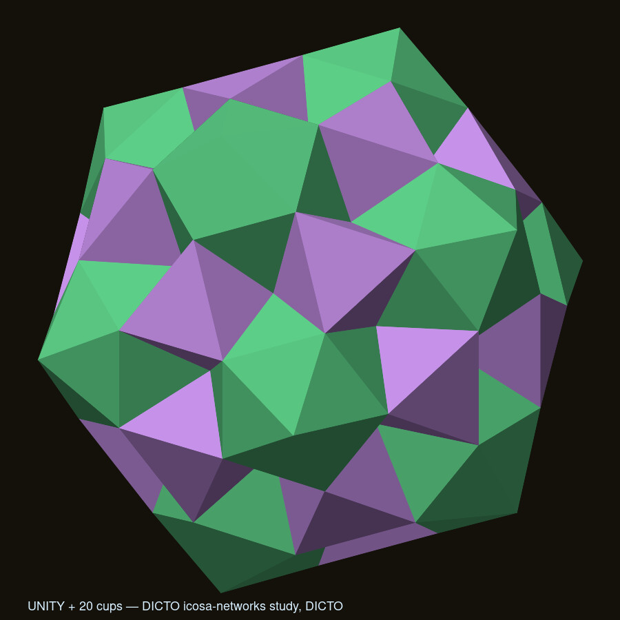 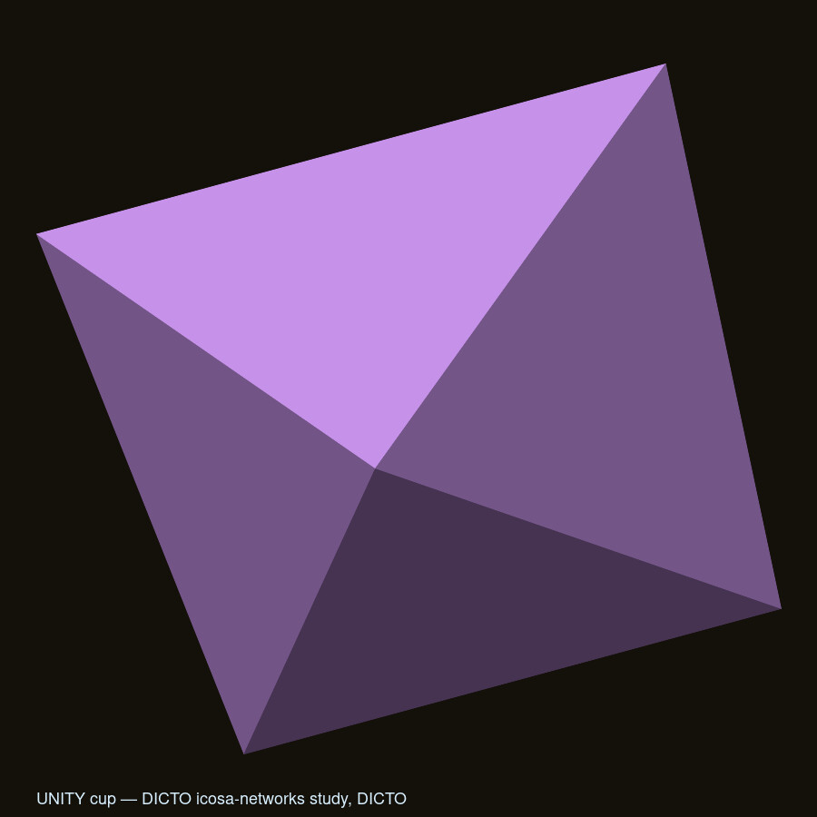

## 2. The crown star (working label): the DICTO-Star's icosahedral twin

Put a regular icosahedron (edge 1) on each of the icosidodecahedron's 20 triangles, as a parallel copy of
the frame icosahedron. All three vertices match the triangle.

- **No overlap**: 0 of 190 icosahedron pairs, 0 with the icosidodecahedron. Centres at
  2.267284 = 1.511523 (triangle distance) + 0.755761 (icosahedron inradius) on the 3-fold axes, which is the
  circumradius of a dodecahedron of edge φ.
- **The 20 icosahedra share 30 edges**, one per icosidodecahedron vertex, in pairs: each shared edge runs
  radially from an icosidodecahedron vertex (radius φ) to radius φ² (length φ² − φ = 1). The 30 far ends
  are the vertices of an icosidodecahedron of edge φ. This shell is known: Wolfram Demonstrations,
  "Cluster of 20 Icosahedra" ("twenty icosahedra are placed at the vertices of a dodecahedron and connected
  edge to edge"; contributor not shown on the page, in the style of Sándor Kabai's icosahedra demonstrations
  and his Bridges 2011 paper). What was not found there: that the hole inside this shell is exactly an
  icosidodecahedron of edge 1, and the closure below.
- At each icosidodecahedron edge 142.6226 + 138.1897 leaves **79.1877°** over the pentagon, and the five
  icosahedron faces round a pentagon lean inward at that angle. Their apexes form a pentagon of edge 1/φ,
  turned 36°, at height √((5 + √5)/10) = 0.850651 (the pentagonal antiprism's height).
- **Pentagonal cup** (working label, `data/cup`): the convex hull of the pentagon and the five apexes,
  volume (5 + 9√5)/24 = 1.046859. It dissects exactly into Icosa-13 pieces: a **J2** (the Icosa-13 cap,
  apex at height √((5 − √5)/10) = 0.525731), **5 AXE** on the pentagon's edges (the 41.81° sliver between
  the J2 face at 37.38° and the wall at 79.19°; the J2 apex is exactly 1/φ from each wall apex), **5 CLEO**
  (base the small triangle J2-apex, apex_i, apex_i+1), and a **J2 of edge 1/φ** upside down. All congruent
  with the Icosa-13 data files.
- Along each shared edge the two icosahedra leave 360 − 2 × 138.19 = 83.62°, two gaps of 41.81°, one over
  each pentagon at that vertex: the tetrahedron (vertex, far end, apex_i, apex_i+1) is **another AXE**.
- **Pentagram crown** (working label, `data/pentagram-crown`): J2 + 5 AXE + 5 CLEO + J2(1/φ) + 5 AXE as one
  solid. 22 faces: the pentagon (edge 1), 15 equilateral triangles (edge 1) that lie on the five icosahedra
  (3 whole faces each), and a flat top: a pentagon of edge 1/φ with five (1, 1, 1/φ) golden triangles in the
  same plane, a **regular pentagram** whose points are the five far ends at radius φ². Volume
  **(5 + 3√5)/8 = 1.463525**. Closed, Euler 2.
- **Crown star** = icosidodecahedron + 20 icosahedra + 12 pentagram crowns (33 pieces, or 225 convex parts).
  Closed, consistently wound, Euler 2, 272 faces (200 icosahedron triangles, 12 pentagons, 60 golden
  triangles), volume **(120 + 47√5)/3 = 75.031732**, 0 overlapping pairs among the 225 parts. Every contact
  is a whole face. The 12 pentagrams lie in planes at 2.227033 from the centre and touch each other at
  their 30 points. Convex hull: 62 faces (20 triangles, 30 quadrilaterals, 12 pentagons: the
  rhombicosidodecahedron's topology, not regular), 60 vertices at 2φR = 3.077684 (the icosahedra's far
  faces), volume 105.684207, fill 71.00%.

Compare the DICTO-Star: icosidodecahedron + 12 dodecahedra + 20 J63 (33 pieces, closed, every contact a
whole face). The crown star swaps the roles: 20 whole icosahedra on the triangles, and a filler built from
the Icosa-13 pieces on the pentagons. The filler is not a diminished solid as J63 is; it is a cup of
Mosseri–Sadoc tiles under a pentagram.

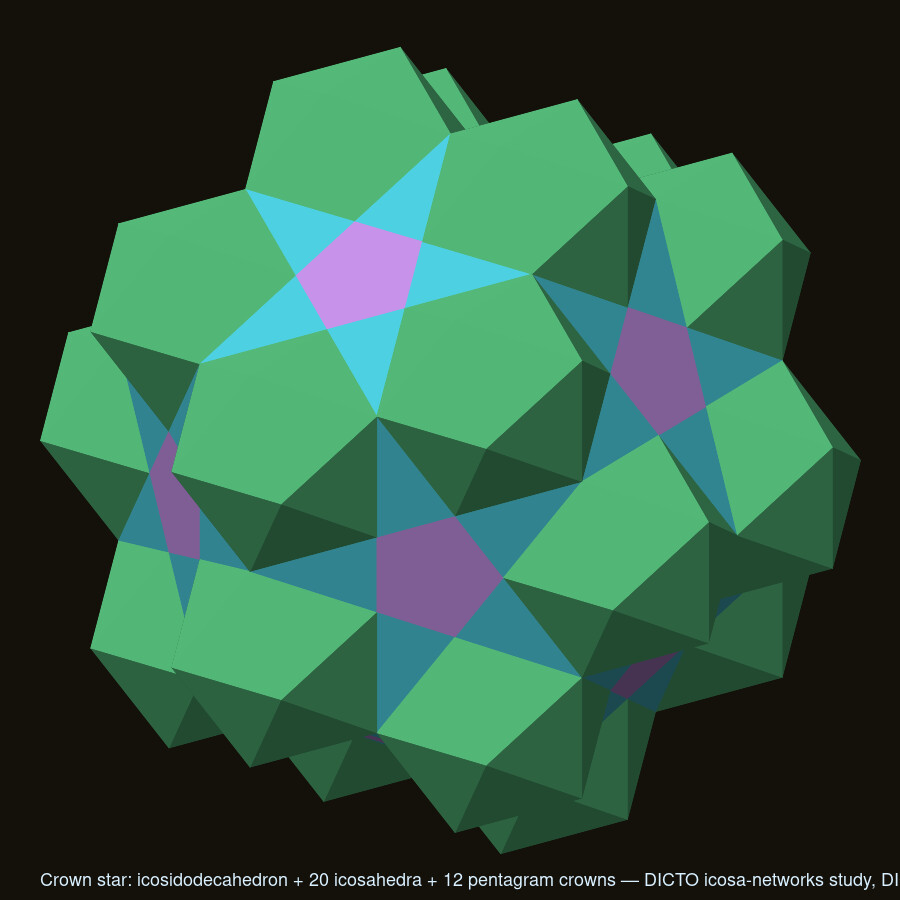 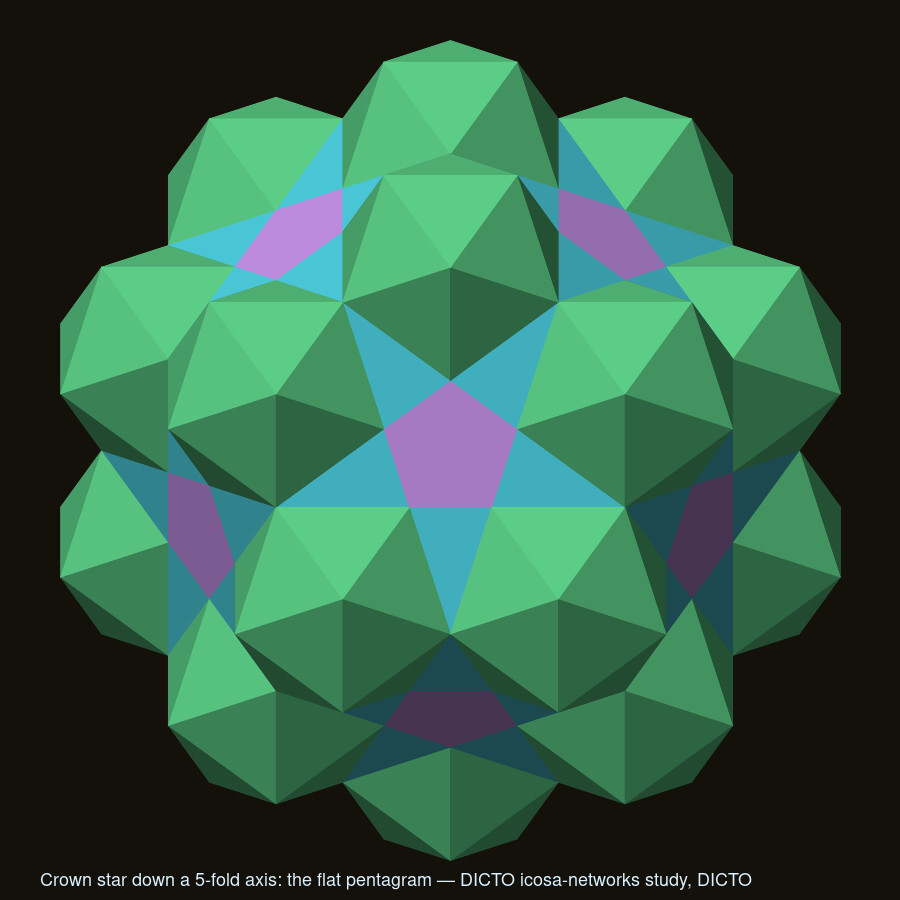
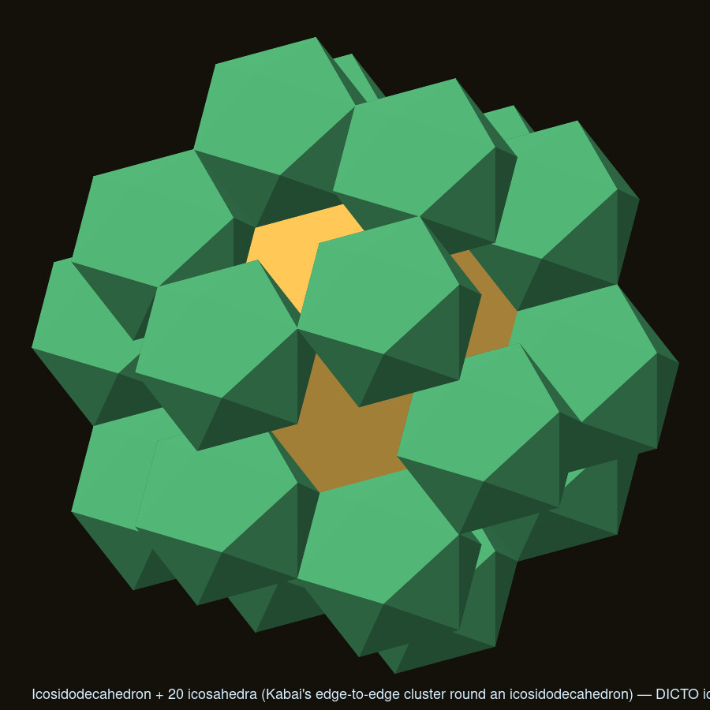 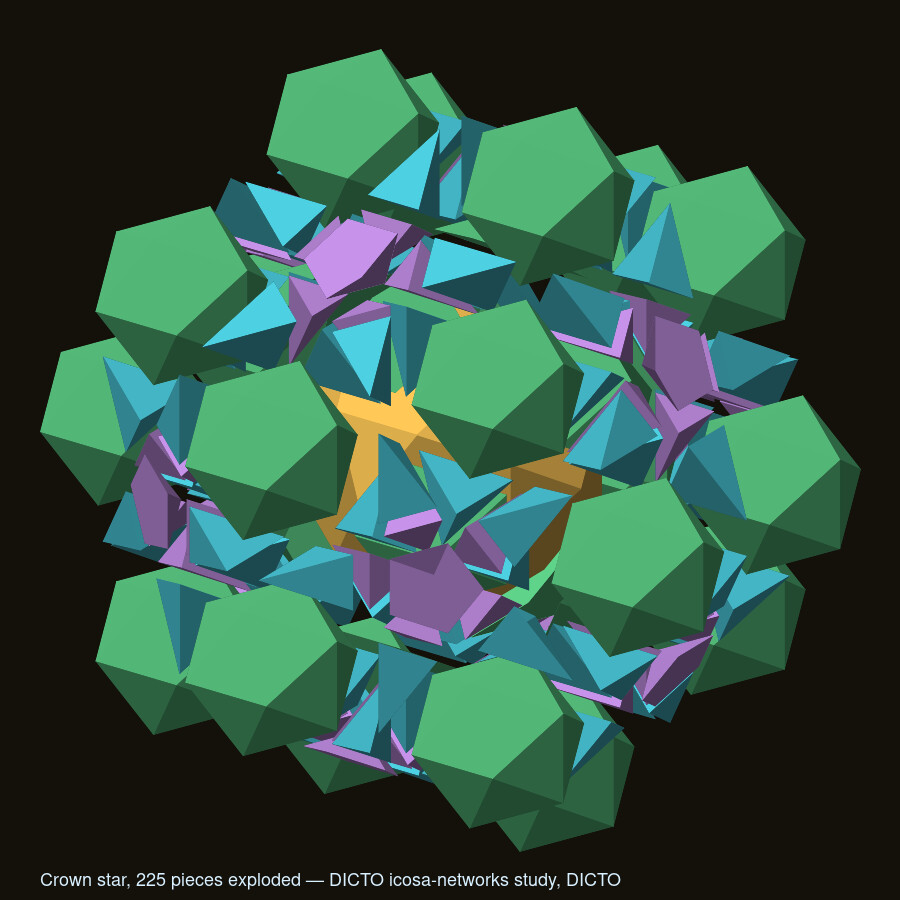
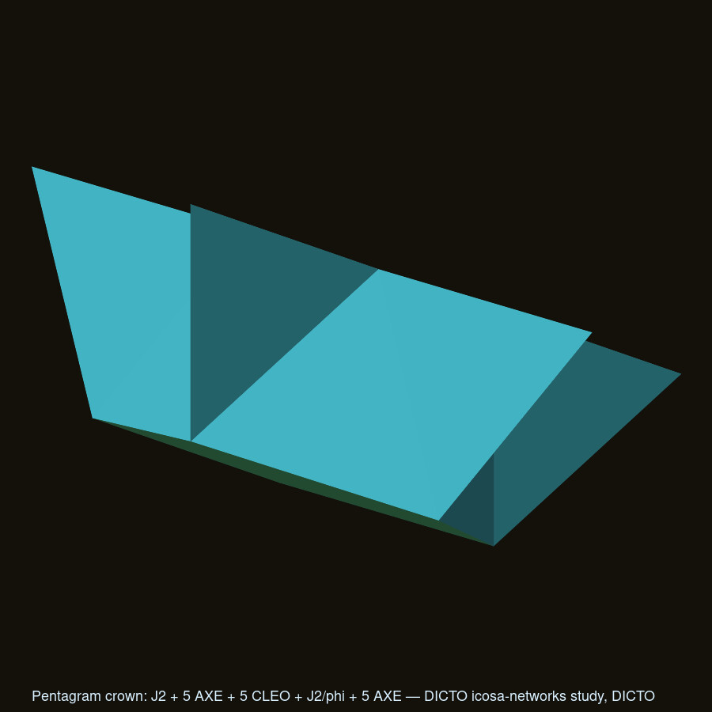 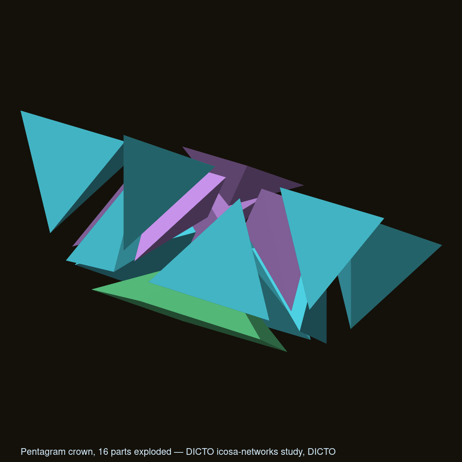

## 3. Networks of the crown star

All tests are pairwise separating-axis tests over all 225 parts of each star, shared pieces excluded.

- **Sharing an icosahedron** (the second icosidodecahedron on the icosahedron's far face, a translation by
  2 × 2.267284 = (5864 − 1209√5)/697 = 4.534568 along a 3-fold axis): clean. The **chain** along one axis
  (period 4.534568) is clean.
- **Face to face** (mirror across the far face of an icosahedron, centres 6.046091 apart): clean. Mirrors
  across the other exposed icosahedron faces overlap (1, 377 and 1575 pairs for faces at 41.81°, 70.53° and
  109.47° to the axis).
- **Two shared-icosahedron neighbours** on 3-fold axes 41.81° apart overlap (214 pairs), 70.53° apart overlap
  (2 icosahedron pairs), 109.47°, 138.19° and 180° are clean. So a star can share icosahedra with up to
  **4 neighbours** at once (a tetrahedron of axes at 109.47°).
- **Diamond network**: stars on two sublattices, A = integer combinations of t_i − t_j and B = A + t_1, where
  t_1..t_4 are the four tetrahedral 3-fold translations of length 4.534568. Each star shares an icosahedron
  with 4 neighbours (A with B along +t_i, B with A along −t_i, all stars parallel copies). All stars within
  reach of the central one were tested: **0 overlaps**. Its translation lattice is fcc with conventional cube
  4φ² = 10.472136 at icosahedron edge 1; net density 49.23% (shared icosahedra counted once). This is a
  periodic network of icosahedral clusters, which the Dodeca-13 never gave (#17's exception).
- **Lattices from three 3-fold translations** (all 13 angle classes of axis triples, 26 nearest translates
  each): none clean; the best has 6 overlapping translates. So the diamond network's 4 neighbours is the
  most, and the chain and the diamond network are the periodic structures found.

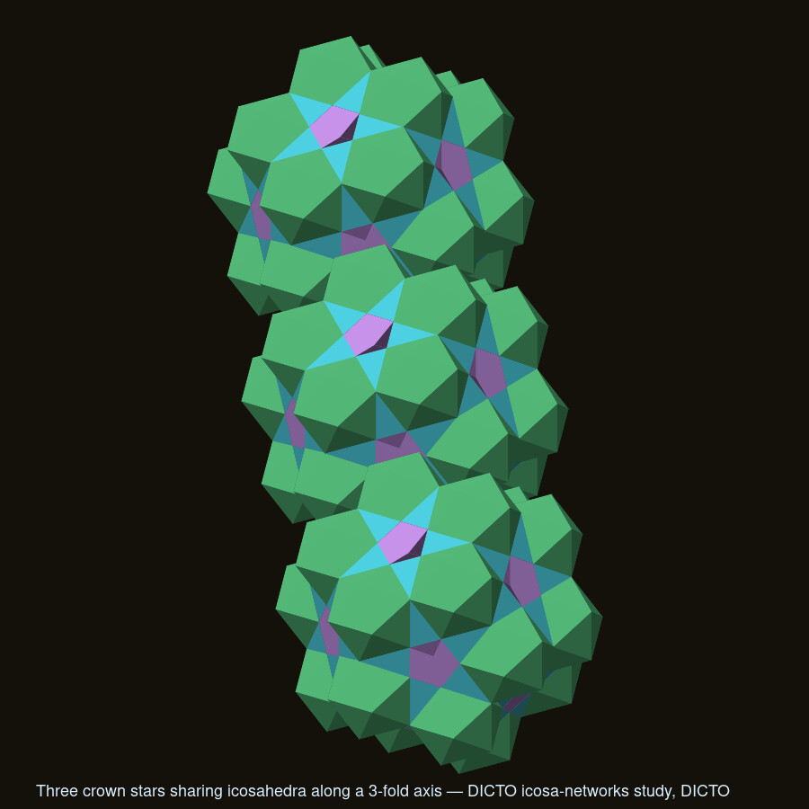 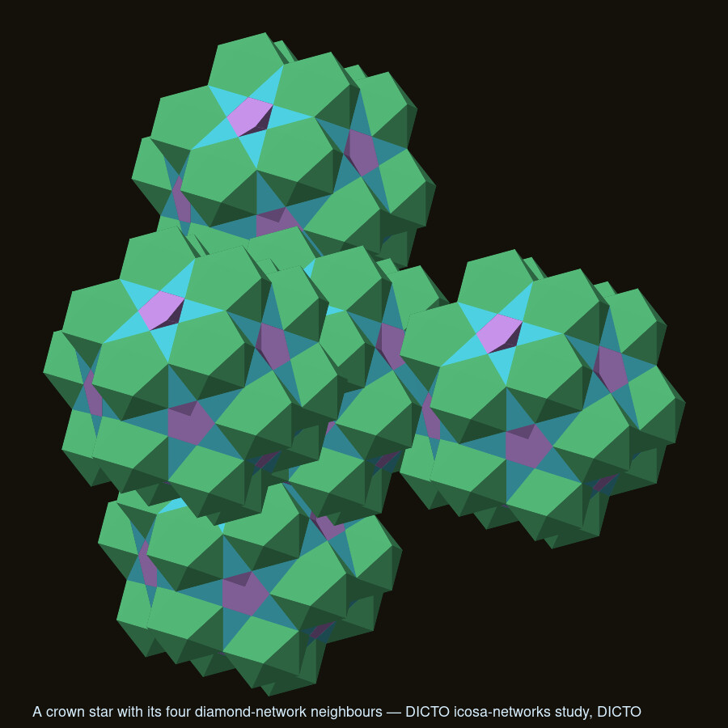

## 4. DICTO's J11 move: "polyhedron + J11 on its unit pentagons"

DICTO built (Polyhedraverse, 2026-10-05) a regular dodecahedron with a J11 on each pentagon. That is the
DESHI cage (each J11 + its cap inside the dodecahedron = one outer icosahedron). Checked here for the four
Archimedean/Platonic solids with unit pentagons (`j11.mjs`, `data/j11-*`):

| Core | J11 placed | Overlap | J11 contacts | Angle left at a pentagon edge | Union |
|---|---|---|---|---|---|
| dodecahedron | 12 | none | 30 shared edges (= DESHI) | 116.57 + 2 × 100.81 leaves 41.81° (AXE) | closed, (65 + 25√5)/4 |
| icosidodecahedron | 12 | none | 30 shared vertices (= UNITY) | 116.57° over the triangle | closed, (60 + 22√5)/3 |
| truncated icosahedron | 12 | none | none | 116.57° over the hexagon | closed, (175 + 61√5)/4 |
| rhombicosidodecahedron | 12 | none | none | 110.91° over the square | closed, (195 + 85√5)/6 |

- **Lotus seed as DICTO's build**: dodecahedron + 12 J11 + 30 AXE + 20 FUJI = 63 pieces, no overlap, one
  closed solid with the same 80 faces (60 triangles, 20 hexagons) and the same volume
  (235 + 105√5)/12 = 39.148928 as the Icosa-13's 113-piece build (`data/lotus-seed-63`). The J11 cage
  (DESHI) with the Inner Eye filled by the dodecahedron is the parallel twin of UNITY.
- Prior art for the DESHI arrangement: R. W. Gray, "More Icosahedron Scaling and Packing" (2002): icosahedra
  on the 12 pentagons of a dodecahedron, each touching a central icosahedron at a vertex, all 12 defining a
  larger icosahedron; his rule (an icosahedron of scale pⁿ contains a centre of scale pⁿ⁻³ and 12 connecting
  icosahedra of scale pⁿ⁻²) is DESHI inside the Lotus seed. Gray does not fill the gaps and has no pieces;
  the exact dissection (AXE, FUJI, CLEO) and the J11 reading are not his. Gray also claims icosahedra "scale
  pack, with the regular dodecahedron, to fill all space", with no construction given on either page; the
  claim could not be checked.

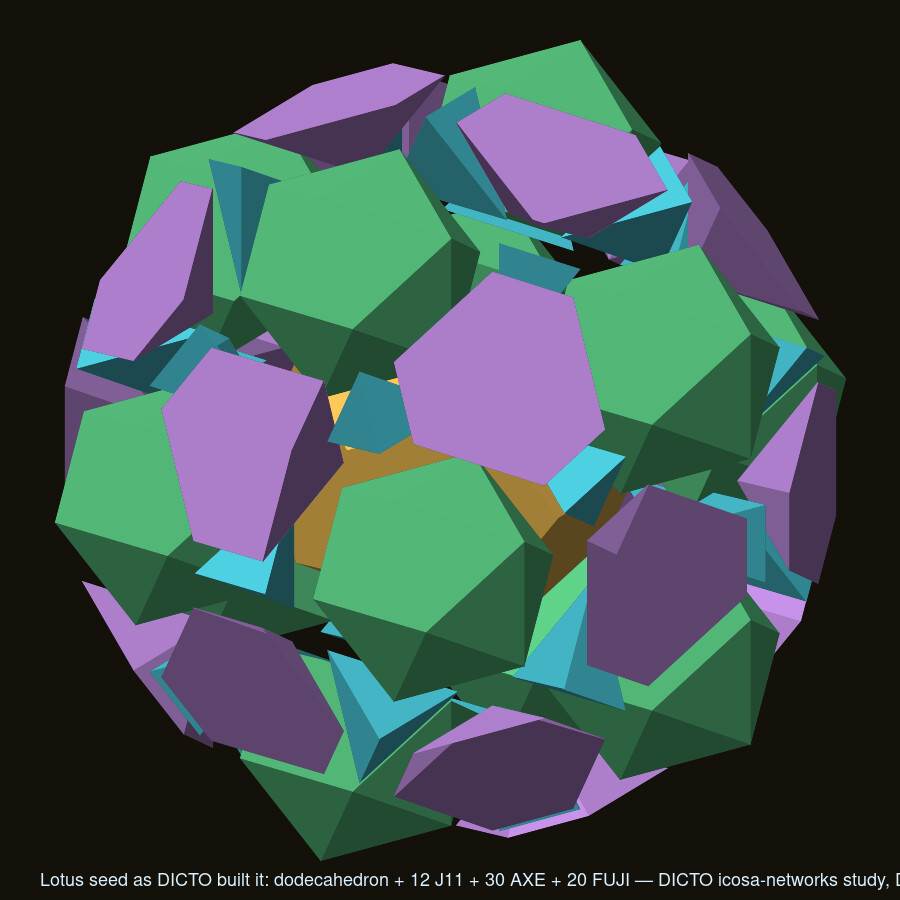 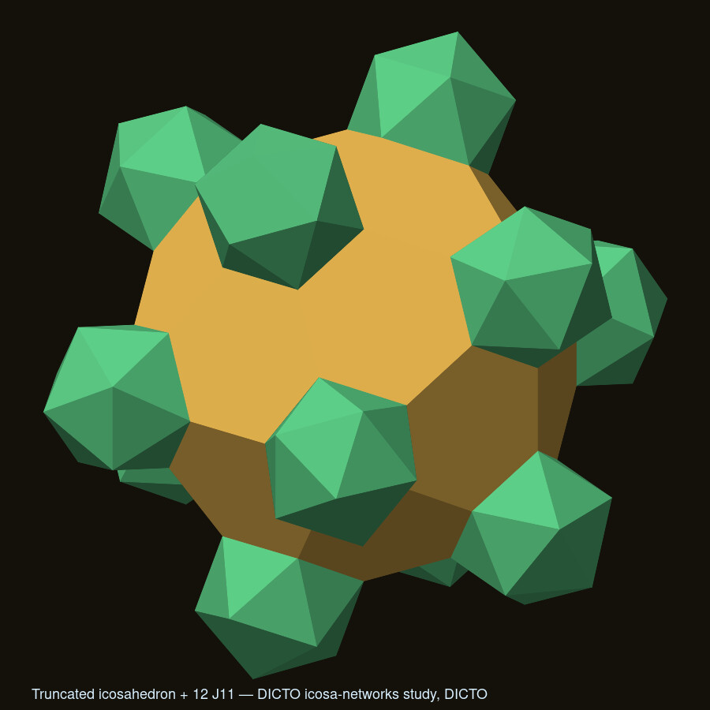 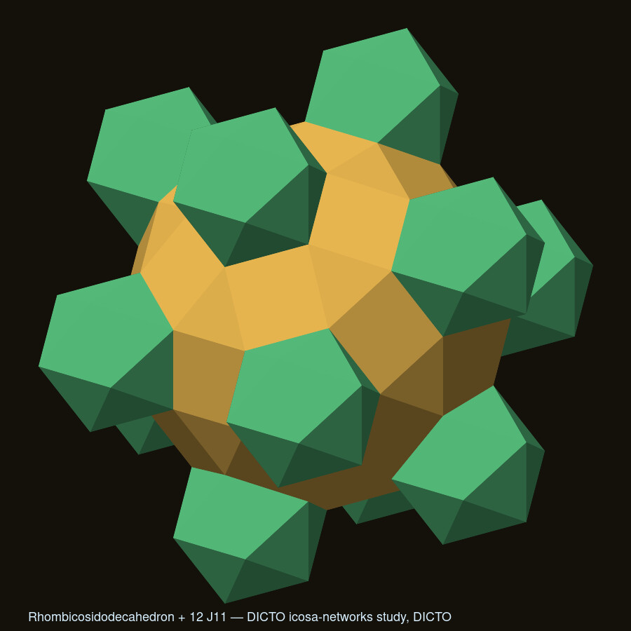

## 5. The Dogstar echo: holes of icosahedron lattice packings

Hart's Dogstar is the hole of the densest lattice packing of dodecahedra, sealed because neighbouring
dodecahedra meet flat on parts of faces all round each odd cell. The same question for icosahedra
(`lattice.mjs`: bisection on the cell size with separating axes, contact classification by coplanar face
patches, and a periodic voxel flood fill of the gap on a 96³ grid of one lattice cell):

| Lattice (icosahedron edge 1, 2-fold axes on x, y, z) | Parameter | Density | Contacts | Gap |
|---|---|---|---|---|
| simple cubic | φ | 0.515028 | 6 shared whole edges | 48.50%, one labyrinth |
| fcc (even cells of a cubic grid), conventional cube | φ(1 + 1/√5) = 2.341641 | 0.679662 | 12 face patches, 15.3% of a face | 32.03%, one labyrinth |
| bcc, cube | 2φ²/3 = 1.745356 | 0.820676 | 8 face patches, 2/3 of a face (regular hexagons) | 17.93%, one labyrinth |
| Betke–Henk optimal lattice (Torquato & Jiao 2009, App. A vectors) | 1 | 0.836357 (paper 0.836357) | 12 touching neighbours, face patches 71.2% of a face | 16.36%, one labyrinth |

In every case the gap wraps round the cell: it is one connected labyrinth, never a set of sealed holes. The
voxel gap volumes match the exact ones to 0.5%. So **no Dogstar twin exists for icosahedra in a lattice
packing**: the icosahedron's faces are too small to wall off a cell, and the Sunstar, Jewel and Kagome-hull
regroupings (#15–#17), which need even and odd cells, have no icosahedral version. The Icosa-13 study's
"fcc 6.130495" for the Lotus seed equals 2.341641 × φ² and agrees.

## 6. Lotus seed and DESHI networks

The Lotus seed is a regular icosahedron of edge φ², so its networks are the icosahedron's:

- Corner sharing (two seeds sharing an outer icosahedron, centres 2φR apart) is a covering, not a packing
  (Icosa-13 §4).
- **Column**: mirror copies face to face along a 3-fold axis, period 4 × inradius = 3.023045 at edge 1,
  7.914435 for the seed. Clean; the contact is the whole big face.
- **bcc**: the densest aligned lattice (0.820676), neighbours meeting on regular hexagons (two-thirds of a
  face); for the seed, cube 4.569401 as the Icosa-13 found.
- The Betke–Henk lattice (0.836357) is the densest known; its contacts are 71.2% face patches.

## 7. The Star Chain echo: nesting on the pentagrams

The crown star's 12 pentagrams invite the next scale. On the inner pentagon (edge 1/φ) of a pentagram:

- an **icosidodecahedron of edge 1/φ** fits with 0 overlaps; a **dodecahedron of edge 1/φ** fits with 0 overlaps
  (its three faces at each pentagon vertex clear the icosahedra, whose faces rise at 142.62° from the
  pentagram plane, the icosidodecahedron's own angle);
- a small UNITY (17 overlapping pairs), a small DESHI (27) and a small crown star (575) do not.

So the chain stops after one step with these pieces. Not pursued further; a different second-scale piece
(e.g. a small icosidodecahedron with pieces on its triangles only) is open.

## 8. Prior art (library first, then web, 2026-10-10)

- Mosseri & Sadoc 1982; Koca, Koc, Koca & Al-Siyabi 2020 (library): AXE = t6, CLEO = t4 at scale 1/τ. The
  crown star's fillers are these tiles plus two pentagonal pyramids.
- Wolfram Demonstrations, "Cluster of 20 Icosahedra": the 20-icosahedron edge-to-edge shell at the vertices
  of a dodecahedron (§2). Contributor not shown; Sándor Kabai's "Rings of 20 Icosahedra", "Icosahedra along
  the Edges of Icosahedra" and Bridges 2011 ("Inside and Outside the Rhombic Hexecontahedron", 20 prolate
  rhombohedra, 20 icosahedra touching the RH's tips) are the same family. Kabai 2010 is in the library.
- R. W. Gray 2002: the DESHI arrangement and its scaling rule (§4).
- Robert Austin 2014 (DISCOVERIES #14): icosidodecahedron + dodecahedra + whole icosahedra, overlapping.
  The crown star has no dodecahedra, so it does not overlap.
- Hart 1996, Walser: the Dogstar and its space-filling with dodecahedra (no icosahedral version exists, §5).
- Betke & Henk 2000, Torquato & Jiao 2009 (library): icosahedron lattice packings.
- Not found at web level: the icosidodecahedron as the hole of the 20-icosahedron shell, the pentagram
  crown, the closed crown star and its exact volume, the diamond network of crown stars, the J11 move on the
  truncated icosahedron and rhombicosidodecahedron, and the 63-piece Lotus seed. Not proof of novelty.

## 9. Recommendation and questions for DICTO

Recommendation: the **crown star** is the result to keep. It is the DICTO-Star's twin in every count (33
pieces, closed, whole-face contacts, exact volume), it is built from pieces DICTO already named, and it is
the first icosahedral cluster here with a periodic network (the diamond network). Polyhedraverse pieces:
crown star, pentagram crown, cup, UNITY cup, and the J11-move solids; Kaleidohedra: the chain and the
diamond network as views, with the shared icosahedra drawn once.

**DICTO's decisions (2026-10-10):**
1. Names: given, see the table at the top.
2. Credit: plain prior-art lines, as in §8 and in `docs/SOURCES.md`.
3. The diamond network becomes a world (queued; the design questions come first).
4. The J11 move goes on every Polyhedraverse solid with unit pentagons (queued).
5. "No icosahedral Dogstar" is recorded as a closed result (DISCOVERIES #19).
6. The second scale on the pentagrams is pursued in a follow-up study.

## Files

`data/`: `crown-star` (crown star with the inverted small dimples), `crown-star-flat`, `crown-star-2` (closed
crown star), `crown-star-2-parts`, `crown-star-parts`, `crown-star-bare`, `crown-star-hull`, `pentagram-crown`,
`pentagram-crown-parts`, `crown`, `cup`, `crown-parts`, `crown-star-chain-3`, `crown-star-diamond-5`,
`unity-cup`, `unity-cups-parts`, `j11-dodecahedron`, `j11-icosidodecahedron`, `j11-truncated-icosahedron`,
`j11-rhombicosidodecahedron`, `lotus-seed-63`; each in unit and raw scale with the checks it passed.
`renders/`: the JPGs above (icosahedra green, icosidodecahedron gold, AXE cyan, CLEO and pyramids purple).
