# Growth on the pentagrams of the DICTO Stella-Corona (design study, 2026-10-10)

Research only, no app changes. Credit: DICTO (design study, 2026-10-10), with Claude (Fable). Follow-up to
the icosa-networks study, decision 6: "pursue the second scale on the pentagrams".

DICTO's question: what can grow on the 12 flat pentagrams of the Stella-Corona at the 1/φ scale and beyond, so
that the Stella-Corona grows outward like the Star Chain Reaction. Which pieces, does the second layer close
(whole-face contacts, no overlaps), does it repeat with factor φ, and does any version link to the inflation of
the Mosseri–Sadoc / Kramer tilings.

Scale **unit** = icosahedron edge 1 (`data/*-unit.json`; `*-raw.json` = unit / (φ/2), the EKP frame). Names are
DICTO's: Stella-Corona, 12-Star voids, HMV, Five of Cups, King of Pentacles, Venus, VAJRA, AXE, CLEO, FUJI,
DESHI, UNITY. The new shapes carry working labels in the sections below; DICTO's names are in the table
"Names and DICTO's rule".

Checks on every result: closed (every edge in two faces), consistently wound, Euler 2, no overlap by separating
axes over every pair of convex parts (the Stella-Corona is 225 parts), volumes in exact golden form, repeated
pieces congruent by edge multiset and volume. Research scripts (kept with the study's working copy, not in the repo): `corona.mjs` (the Stella-Corona as
parts, placements), `growth1.mjs` to `growth13.mjs` with logs `growth*.log` and `results-growth*.json`, `render.mjs`.

**A correction first.** The icosa-networks study's §7 (now marked there) said a small UNITY, DESHI and Stella-Corona overlap the
star. Two of those tests were wrong in the same way: the small solid was placed with its base piece pointing
*into* the crown (the base J11, or the whole small star mirrored inward, because the base pentagon's normal was
already parallel to the pentagram's axis and the rotation step was skipped). Placed outward, the overlaps that
remain are real and much smaller (§2). The old numbers (17, 27, 575 pairs) should be read as superseded by this
study.

## Summary

| Growth on each pentagram (edge 1/φ unless said) | Result | Volume of the whole (exact) |
|---|---|---|
| Any single solid with a pentagon of edge 1/φ on the inner pentagon: dodecahedron, icosidodecahedron, J2, J11, pentagonal antiprism, prism, the tall spike | **Fits**, all 12 at once, closed, Euler 2 | e.g. + 12 dodecahedra (165 + 56√5)/3; + 12 ID (90 + 113√5)/3 |
| **Kepler star** (working label): Kepler's small stellated dodecahedron, core edge 1/φ, minus the spike on its base pentagram (dodecahedron + 11 spikes) | **Fits, and the layer closes**: its flat pentagram is exactly the King's pentagram, every contact a whole face (the small J2's pentagon + 5 golden triangles). 12 at once: closed, 800 triangles, Euler 2 | **(165 + 89√5)/3 = 121.336683**, the **Kepler layer** (working label) |
| ID + 6 J11 (UNITY minus its 6 lower J11); dodecahedron + 6 J11 (DESHI minus its 6 lower J11) | **Fits**, 12 at once, closed | (45 + 176√5)/3; (120 + 119√5)/3 |
| ID + 5 **G-wedges** (Mosseri–Sadoc t2 at the Icosa-13 scale) | **Fits exactly**: each wedge shares a whole face with the pentagram and a whole face with the small ID | (225 + 211√5)/6 |
| King of Pentacles (1/φ), pentagon down | **Fits**; stacked, a **King spire** (1/φ, 1/φ², …) is the clean factor-φ self-similar growth, closed at every level | limit (525 + 197√5)/12 = 80.458783 |
| **Bud** (working label): the most of a 1/φ Stella-Corona that fits on all 12 pentagrams at once: ID + 10 icosahedra + 1 King on its top pentagon | **Fits**, 12 at once; the bud's King takes a 1/φ² bud, and so on: **self-similar with factor φ along the 12 five-fold axes**, converging at radius φ² D = 5.830447 | level 1 (517√5 − 75)/6; level 2 (1335 − 322√5)/3 |
| A whole 1/φ Stella-Corona, a whole 1/φ 12-Star voids, a 1/φ UNITY or DESHI | **Impossible** (§2): the 5 small icosahedra on the base pentagon's edges need 100.81° below the pentagram plane; the lower J11s hit the big icosahedra; 12 full buds clash with each other (30 pairs, centres 0.618 apart) | |
| Two Stella-Coronas King to King (mirror across a pentagram) | **Impossible**: 5 icosahedron pairs overlap (each big icosahedron shows a J2 cap 0.525731 above the plane) | |
| Two Stella-Coronas through one Kepler star (two spikes removed) | **Fits along a 5-fold axis only**, period φ² D = 5.830447: a **Kepler chain**; the 63.43° faces clash by 3 pairs, the 116.57° faces by 426 | |
| A golden closure of the gaps round the small dodecahedron or ID with Mosseri–Sadoc tiles | **Not found**: a greedy search (both scales, both chiralities, two contacts required) leaves crevices of 26°, 37°, 41°, 63°, 79° (§5) | |

## 1. The free region over a pentagram

The pentagram lies in a plane at D = 2.227033 from the centre (D = φ²·0.525731 + 0.850651: the icosidodecahedron's
pentagon distance plus the pentagonal antiprism height). Inner pentagon edge 1/φ (vertices A), legs 1, points Y
on a pentagon of edge φ (the Y are vertices of an icosidodecahedron of edge φ).

- Each of the five icosahedra round the pentagram shows **a J2 cap above the plane**: the plane passes through
  five of its vertices (a regular pentagon of edge 1 containing the notch Y, A, Y) and one vertex stands
  0.525731 above it. So the free region is the half-space above the pentagram minus five J2 caps of edge 1.
- Along a leg Y A the AXE-2 below takes 79.19°, the icosahedron 138.19°, leaving **142.62°** free above the
  plane (the icosidodecahedron's own dihedral). Along an inner edge A A the plane is flat (180° free).
- The pentagram + the 5 notches = a pentagon of edge φ. Anything that uses the notches collides with the J2
  caps; so what grows must stand on the pentagram, on its inner pentagon, or on its five golden triangles.

## 2. What is impossible, with the numbers

- **A whole 1/φ Stella-Corona (or 12-Star voids).** The small icosidodecahedron fits (0 overlaps), but its five
  triangles on the base pentagon's edges lean out at 37.38° over the pentagram, and an icosahedron on such a
  triangle takes 138.19° beyond it, so it reaches 100.81° below the pentagram plane: into the AXE-2 (63.43°)
  and the CLEO. Measured: each of the five base icosahedra overlaps 7 parts (2 ico, 2 AXE, 1 CLEO, 2 AXE-2).
  The other 15 icosahedra and the 6 upper Kings are clean on one pentagram (`small-corona-one.jpg`).
- **Twelve at once.** With 15 icosahedra per small star, neighbouring stars clash: 30 icosahedron pairs,
  centres 0.618034 apart (two small icosahedra need 0.934172). Dropping every clashing one leaves **10 per
  pentagram** (the 5 round the top pentagon and one of each belt pair) and then only the top King keeps all
  five walls. That is the bud of §4.
- **Small UNITY and DESHI.** With the base J11 removed, the 5 lower J11s of UNITY hit the big icosahedra (5
  pairs), the 5 lower J11s of DESHI hit icosahedra and AXE-2 (15 pairs). The 6 upper J11s are clean (§3).
  Venus adds 5 lower VAJRA cups that overlap too (20 more pairs).
- **King to King.** Mirroring the Stella-Corona across a pentagram plane gives 5 overlapping icosahedron pairs:
  the J2 caps of §1 pass through the plane into each other.
- **The Kepler stars (and the great stellated dodecahedron) as whole solids.** The pentagram face of a Kepler
  solid is not a boundary face: its inner pentagon is covered by a spike. The small stellated dodecahedron
  works only with that spike removed (§3). Its missing spike has base the inner pentagon and height 0.850651,
  so its apex would sit exactly at the centre of the icosidodecahedron's pentagon, inside the King. The great
  stellated dodecahedron with the same pentagram (core 1/φ³, spike tips on a dodecahedron of edge 1) has its
  inner pentagon deep inside its icosahedral core (edge 1/φ), so no removal makes it flat: impossible.

## 3. What fits at 1/φ, and the layer that closes

**The Kepler layer** (`data/kepler-layer`, `kepler-star-11`): a small stellated dodecahedron of core edge 1/φ
has pentagram faces with inner pentagon 1/φ, legs 1 and points on a pentagon of edge φ: exactly the King of
Pentacles' top. Remove the spike on one face and set that face on the pentagram:

- Contacts: the dodecahedron's base face on the small J2's pentagon, and the five golden triangles of its five
  neighbouring spikes on the five AXE-2 faces. **Six whole faces, nothing else touches.**
- 12 at once: 0 overlaps among 144 + 225 parts; neighbouring Kepler stars meet tip to tip at the 30 points Y
  (radius φ²). Union: **800 triangles, closed, Euler 2, volume (165 + 89√5)/3 = 121.336683** (Stella-Corona
  (120 + 47√5)/3 + 12 × (15 + 14√5)/12). Outer radius 4.454065 (72 free tips), convex hull 80 faces, fill 50.57%.
- One Kepler star: 56 faces (55 triangles, 1 pentagon), volume (15 + 14√5)/12 = 3.858746; a spike √5/12,
  height 0.850651; the whole small stellated dodecahedron (5 + 5√5)/4.
- This is the second layer that **closes**: every contact a whole face, no crevice at the contacts. It does
  not repeat at 1/φ: the Kepler star's other 11 face planes carry spikes at the same scale. With a second spike
  removed, the opposite face takes another Stella-Corona: the **Kepler chain** along a 5-fold axis, period
  2(D + 0.688191) = φ² D = 5.830447 (clean, closed; the identity 2 × inradius of the dodecahedron(1/φ) =
  1.376382 = the icosidodecahedron's pentagon distance makes the two expressions equal). The 63.43° faces
  overlap in 3 pairs, the 116.57° faces in 426.

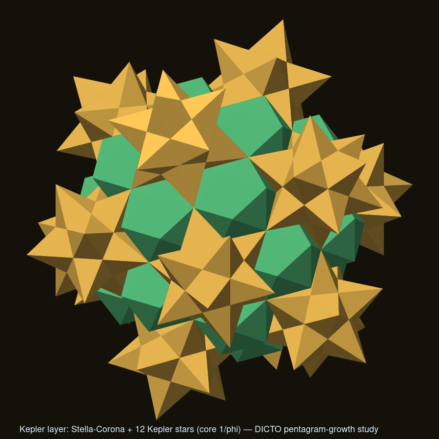 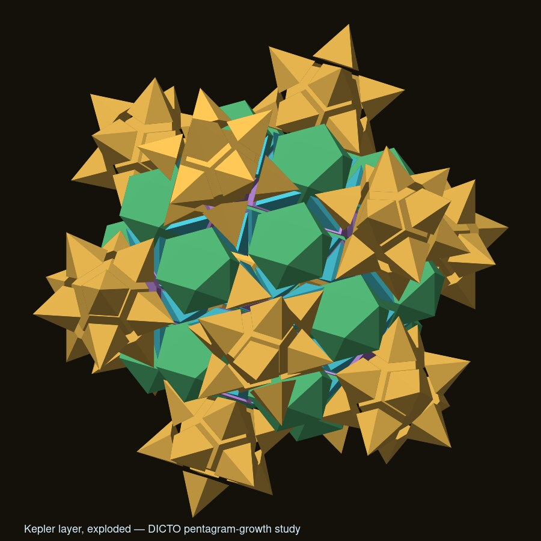
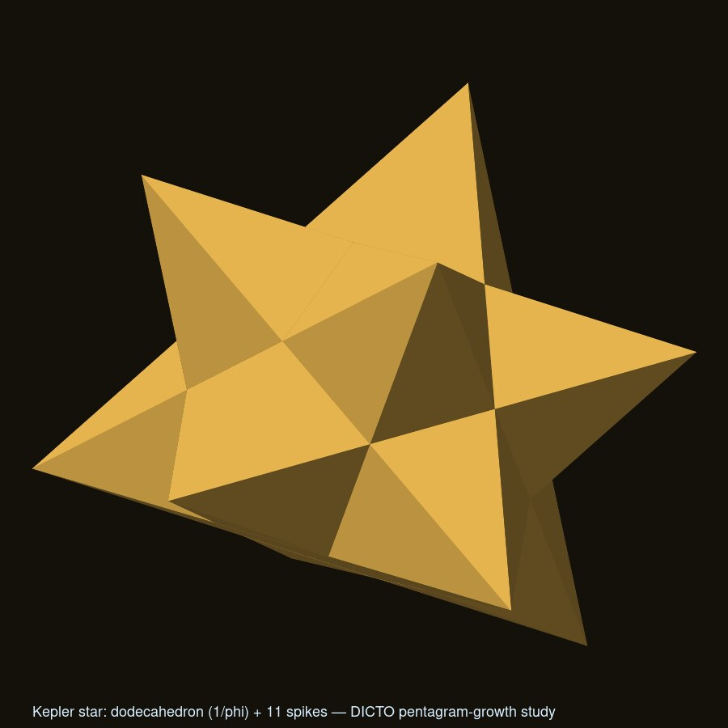 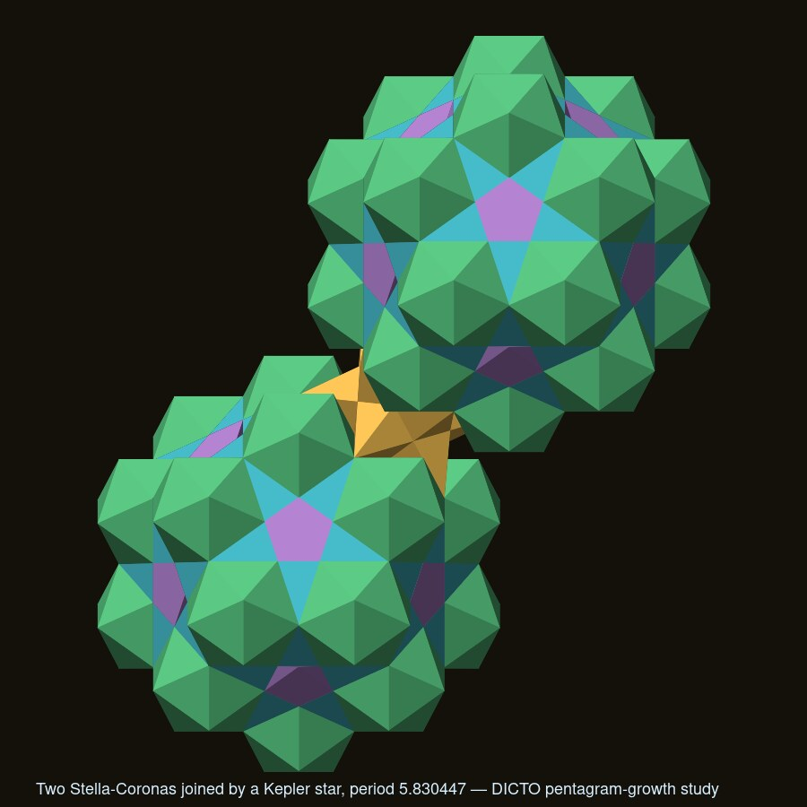

**The six upper J11s** (`data/unity6`, `deshi6`): ID(1/φ) + 6 J11(1/φ) and dodecahedron(1/φ) + 6 J11(1/φ)
fit on all 12 pentagrams (0 overlaps), unions closed, Euler 2, volumes (45 + 176√5)/3 = 146.182655 and
(120 + 119√5)/3 = 128.697363. These are UNITY and DESHI with the lower half of their J11 cage missing; the gaps
to the big icosahedra stay open.

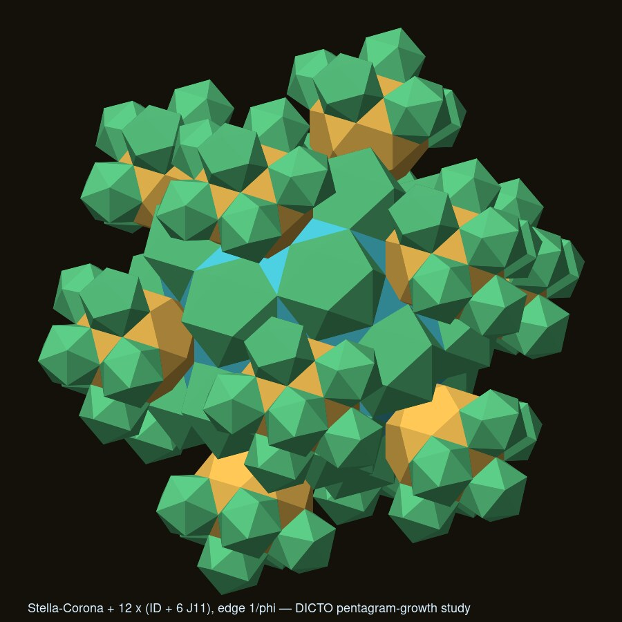 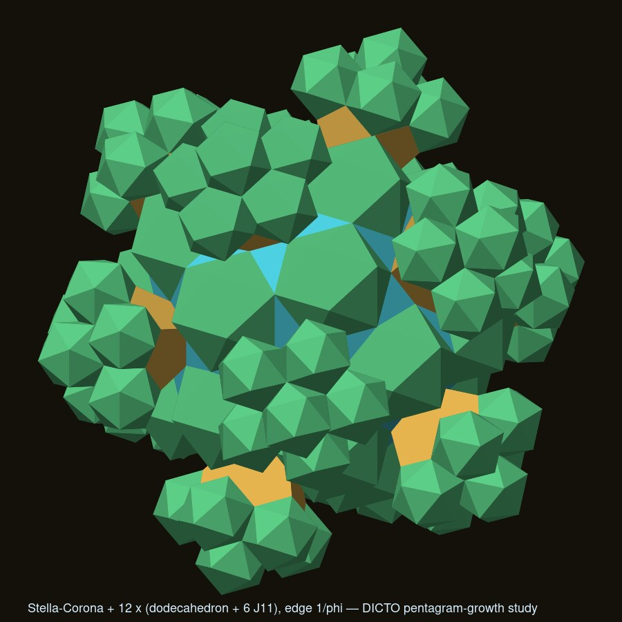

**ID + 5 G-wedges** (`data/id-gwedges`, `t2-gnomon-wedge`): the small icosidodecahedron's triangle on an inner
edge A A leans out at 37.38° over the pentagram's golden triangle. The convex hull of that golden triangle and
the triangle's apex T is the Mosseri–Sadoc tile **t2 (G)** at the Icosa-13 scale (edges 1/φ ×4, 1 ×2, volume
(3 − √5)/24 = 1/(12φ²); faces: one equilateral 1/φ, one acute golden (1/φ, 1, 1), two gnomons (1/φ, 1/φ, 1)):
congruence checked, |Y T| = 1/φ exactly. Each wedge shares a whole face with the pentagram and a whole face
with the small ID. 12 × (ID + 5 wedges): 0 overlaps, closed, Euler 2, volume (225 + 211√5)/6 = 116.135057.
Working label **G-wedge**; it is the first Mosseri–Sadoc tile besides AXE (t6) and CLEO (t4) to appear in the
family. The gaps beyond the wedges do not close (§5).

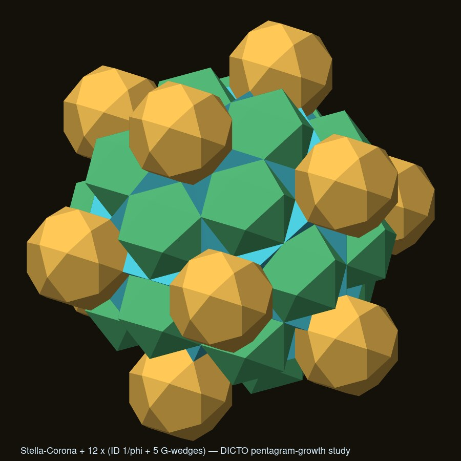 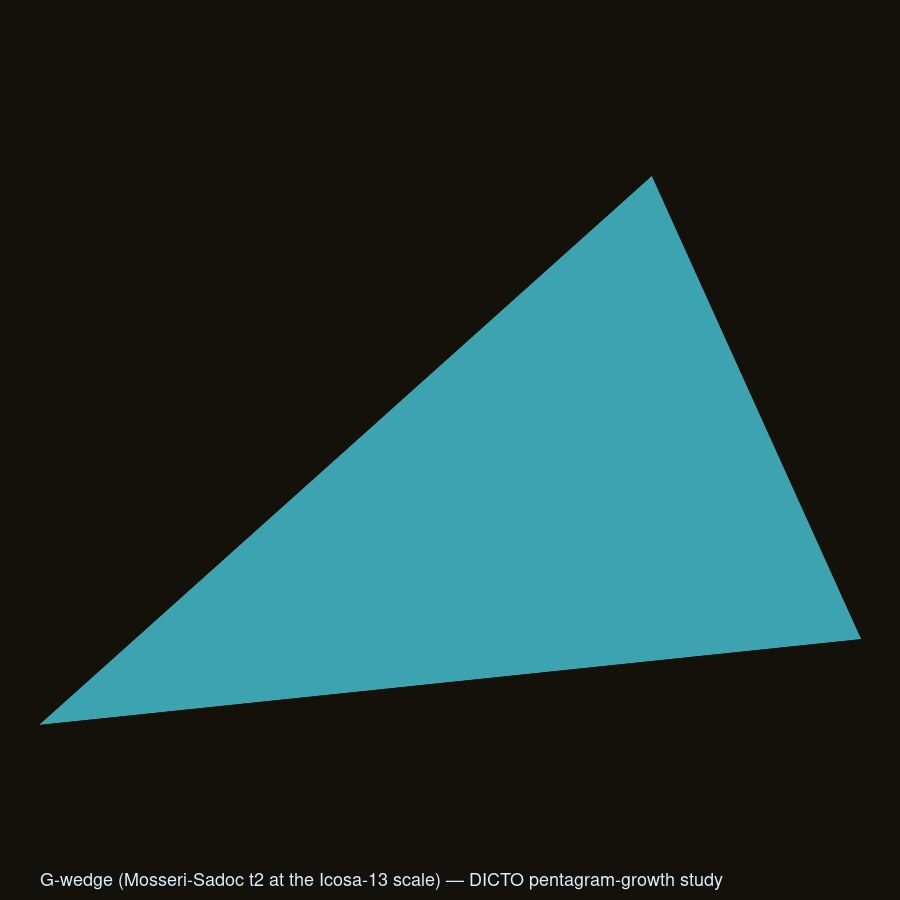

**Single solids** (`growth4.log` (k)): dodecahedron, icosidodecahedron, J2, J11, pentagonal antiprism, the tall
spike (base 1/φ, lateral 1) and the pentagonal prism of edge 1/φ each fit on all 12 inner pentagons with closed
unions (volumes in the log). Smaller copies (1/φ², 1/φ³) fit concentrically but match no vertices.

## 4. Self-similar growth with factor φ

**King spires** (`data/king-spires`): a King of Pentacles of edge 1/φ, pentagon down on the inner pentagon (its
pentagon is the small J2's pentagon, a whole face; its 15 triangles lean in at 79.19°), fits with 0 overlaps,
and so does a King of edge 1/φ² on its pentagram, and so on. 12 spires of 5 Kings: 0 overlaps, union closed,
Euler 2. The spire planes sit at 2.752764, 3.077684, 3.278495, 3.402603, 3.479306 and converge to
D + 0.850651 φ = 3.603415. The infinite spires add 12 V_King /(φ³ − 1) = (15 + 3√5)/4 = 5.427051, total
(525 + 197√5)/12 = 80.458783. Simple and exact, but each King covers only the inner pentagon, so the golden
triangles of every level stay exposed.

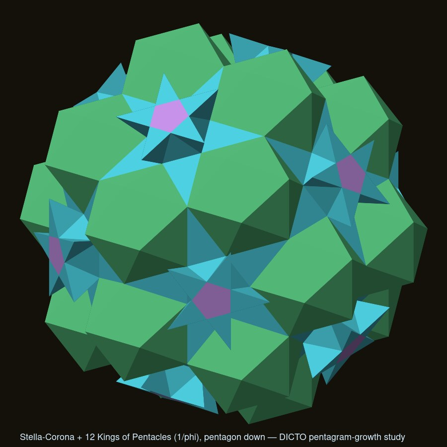 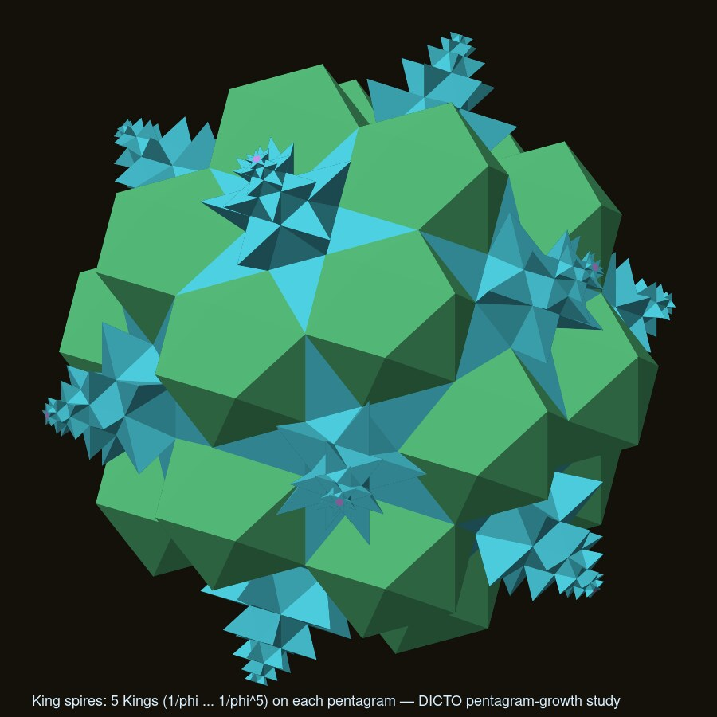

**Buds** (`data/bud`, `buds`, `buds-level2`): the bud is ID(1/φ) + 10 icosahedra(1/φ) + 1 King(1/φ) on its top
pentagon (202 faces as a solid, volume (47√5 − 35)/8 = 8.761899). Twelve buds: 0 overlaps with the star, 0
between buds, closest approach between neighbours 0.618034; volume (517√5 − 75)/6 = 180.174524. Each bud's
King is a 1/φ pentagram in the same surroundings as the big one (five small J2 caps), so a 1/φ² bud sits on
it: **12 level-2 buds, 0 overlaps** (volume (1335 − 322√5)/3 = 204.995370). By similarity every further level
fits the same way along its axis; the bud centres go 3.077684, 4.454066 + …, and the spire of buds converges
at radius φ(D + 1.376382) = φ² D = **5.830447**, which is also the Kepler chain's period: the infinite spire of
buds ends exactly where the next Stella-Corona of the Kepler chain would be centred. The unions' Euler
numbers are 2 − 60 and 2 − 120 because each bud touches the star at five single vertices (five of its
icosahedra meet a big icosahedron vertex to vertex); the solids are fine, the surface pinches there.

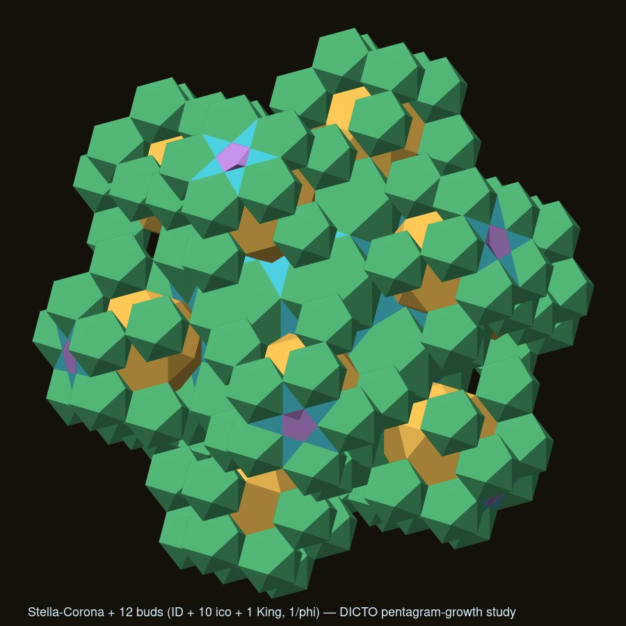 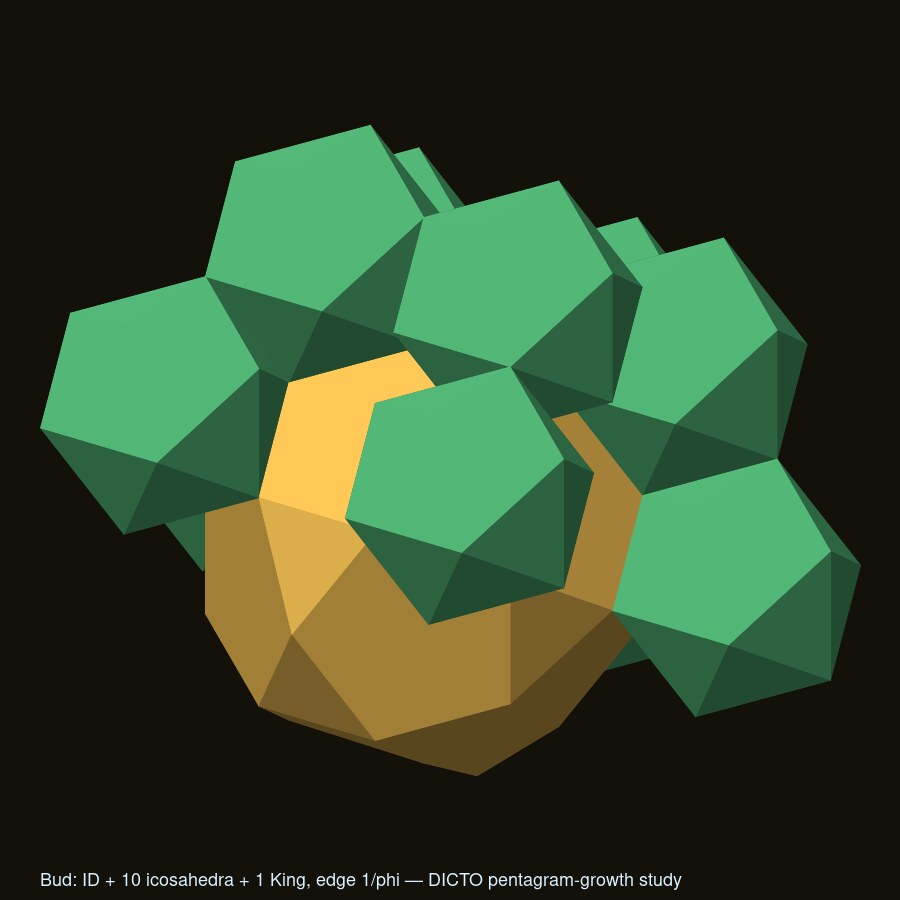 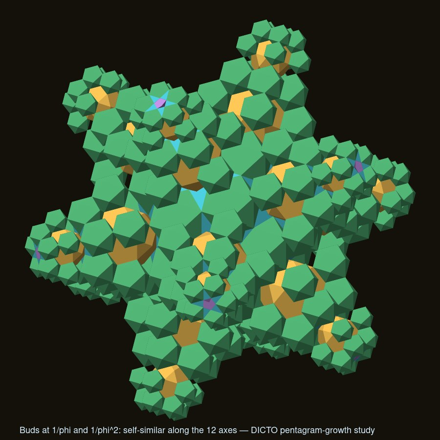

So the answer to "self-similar with factor φ" is: **yes along the 12 five-fold axes, no as a shell.** A 1/φ copy
of the whole Stella-Corona cannot stand on a pentagram (§2), so no layer is a φ-scaled copy of the layer below.
What repeats is a 12-armed tree: on each pentagram a bud (or a King), on its top pentagram a 1/φ² bud, and so
on, every level touching the one below on a whole pentagon. The Star Chain Reaction nests inward by 1/φ³ in
one cell; this grows outward by 1/φ along each axis.

## 5. Does a golden second layer close?

Greedy search (`growth4.mjs` (i)): starting from the bare pentagram, from dodecahedron(1/φ) and from
icosidodecahedron(1/φ), glue Mosseri–Sadoc tiles t1–t6 (and the mirror images of the chiral ones) at the
Icosa-13 scale and at 1/φ of it, whole face to whole face, onto exposed triangles of the growth and of the J2
caps; accept only placements with no overlap and at least two contacts (whole or coplanar partial), best
first.

- Bare pentagram: nothing closes two faces (200 placements tried).
- Dodecahedron(1/φ): 5 AXE (each golden face in the plane of a dodecahedron face, a partial contact: AXE's
  63.43° at its short edge equals the dodecahedron's outer angle) + 10 t5, then nothing; crevices against the
  star of 63.43° (20 edges), 37.38°, 26.06°, 116.57° (10 each).
- Icosidodecahedron(1/φ): the 5 G-wedges with two whole contacts each, then 25 more tiles with only partial
  contacts; crevices of 79.19°, 37.38° (11 each), 116.57°, 41.81°, 100.81°, 142.62°.

No closed golden layer was found. This is a search result, not a proof: pieces outside the six tiles, or tile
placements that create no contact at first, were not tried.

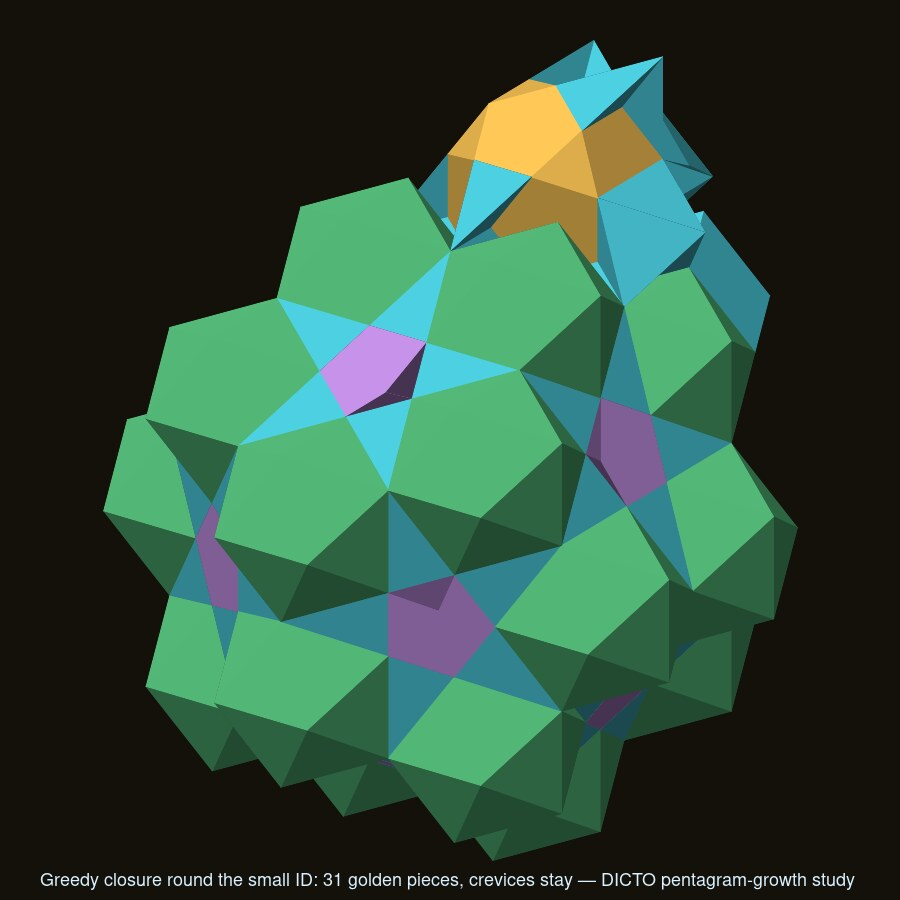

## 6. The inflation link

The Mosseri–Sadoc tiles inflate by τ = φ (a Stein inflation; the inflation matrix has eigenvalues τ and τ³,
Papadopolos & Ogievetsky 1999, in the library). Koca et al. 2020 build the icosahedron, dodecahedron and
icosidodecahedron of edges 1 and τ as composite tiles that reappear at consecutive inflation orders. The pieces
here are those composite tiles at two consecutive orders (edge 1 and edge 1/φ) plus AXE, CLEO and the G-wedge,
which are t6, t4 and t2 at one scale down. But an inflation replaces every tile by a τ-scaled patch all at one
scale, while the pentagram growth is a radial nest with the two scales side by side, and it is confined to the
12 axes (§4). So: same factor, same tiles, not an inflation of a tiling. The one structure here that could
become a patch of a tiling is the Kepler chain (§3), a same-scale periodic column, not a φ-scaled one.

## 7. Prior art (library first, then web, 2026-10-10)

- Mosseri & Sadoc 1982; Koca, Koc, Koca & Al-Siyabi 2020 (arXiv 2009.07048); Papadopolos & Ogievetsky 1999:
  the tiles, the τ inflation, composite tiles. Credit for t2/t4/t6: Mosseri & Sadoc.
- Kepler 1619: the small stellated dodecahedron and its spikes; the Kepler stars here are that solid with one
  or two spikes removed.
- Sándor Kabai, Wolfram Demonstrations: "Building on an Icosahedron" (a cluster of icosahedra with the great
  stellated dodecahedron), "Icosahedron Fractal" (towers of icosahedra shrinking by 1/2 along the edges of an
  icosahedron, "could be replaced by a fractal icosahedron"), "Building a Small Stellated Dodecahedron";
  Kabai 2010 (Bridges) in the library. Related family, not this construction.
- Teo & Zhang, "clusters of clusters" of vertex-sharing icosahedra in Au–Ag supraclusters: the icosahedron-of-
  icosahedra growth sequence, a chemistry relative of the buds.
- Not found at web level: a small stellated dodecahedron set on an icosahedron cluster's pentagram, the Kepler
  layer and its exact volume, the Kepler chain, the G-wedge fit, King spires, buds and their φ² D limit.
  Searches: Wikipedia compounds of small stellated dodecahedra, MathWorld, Wolfram Demonstrations, Bridges
  archive. Not proof of novelty.

## 8. New shapes needing names (working labels)

| Working label | One line | Data |
|---|---|---|
| Kepler star | Kepler's small stellated dodecahedron, core 1/φ, minus the spike on its base pentagram; dodecahedron + 11 spikes, 56 faces, (15 + 14√5)/12 | `data/kepler-star-11` |
| Kepler layer | Stella-Corona + 12 Kepler stars, 800 triangles, (165 + 89√5)/3 | `data/kepler-layer` |
| Kepler chain | two Stella-Coronas through a Kepler star with two spikes removed, period φ² D = 5.830447 | `data/kepler-chain-parts` |
| G-wedge | Mosseri–Sadoc t2 at the Icosa-13 scale, (3 − √5)/24; fits between a pentagram triangle and the small icosidodecahedron | `data/t2-gnomon-wedge` |
| Bud | icosidodecahedron + 10 icosahedra + 1 King, all 1/φ: the most of a small Stella-Corona that fits on every pentagram at once | `data/bud` |
| King spire | Kings of Pentacles at 1/φ, 1/φ², … stacked on a pentagram | `data/king-spires` |
| UNITY-6, DESHI-6 | ID (or dodecahedron) + the 6 upper J11 at 1/φ | `data/unity6`, `data/deshi6` |

## 9. Recommendation and questions for DICTO

Recommendation: keep the **Kepler layer** as the closed second layer (it is exact and every contact is a whole
face, like the Stella-Corona itself), and the **buds** as the φ-self-similar growth (12-armed, converging at
φ² D). The King spires are a simpler version of the same growth. For Polyhedraverse: Kepler star, G-wedge, bud;
for Kaleidohedra: the Kepler layer, the Kepler chain, and the buds at two or three levels as views.

Note: §10 found 60 crevices of 26.06° along the Kepler layer's spikes, so its contacts are whole faces but it is
not fully closed; see §10.

**DICTO's decisions (2026-10-10):** names given (table below); keep searching for a golden closure (done, §10);
correct the icosa-networks §7 (done); a contact covered completely by several faces counts as closed. Still
open: which growth goes into the apps first, and 12 half-buds or 3 full buds.

## Names and DICTO's rule (2026-10-10)

DICTO named the shapes after seeing them in 3D. The sections above keep the working labels:

| Working label | DICTO's name |
|---|---|
| Kepler star | **DICTO Kepler star** |
| Kepler layer | **Kepler Star Diadem** |
| Kepler chain | **KEPLER MACE** |
| G-wedge (Mosseri–Sadoc t2) | **Hound Tooth** |
| Bud | **Rosebud** |
| King spire | **Cosmic Seed** |
| UNITY-6 | **Pineapple Diadem** |
| DESHI-6 | **DESHI-6** |
| E-cap (Mosseri–Sadoc t3) | **Tricap** |
| golden leg closure | **Golden Closure** |
| derived crevice piece, small dodecahedron | **Bermuda Pyramid** |
| derived crevice piece, Kepler star | **Shark Tooth** |

**Rule:** "if the space is covered completely, it's closed." A contact covered by several faces (such as three
triangles on one pentagon) counts as closed. So the Golden Closure closes the legs round each small
icosidodecahedron; the 142.62° crevices one layer out are still open.

## 10. The golden closure search, continued (DICTO: "keep searching")

Library now: the six Mosseri–Sadoc tiles and their mirror images, FUJI, VAJRA, J2, J11, half J2, half AXE, CLEO
thirds, the G-wedge, each at the Icosa-13 scale and at 1/φ of it; plus pieces derived from the crevice geometry
(VAJRA style: the convex hull of the two faces at a concave edge). Scripts `growth6.mjs` to `growth13.mjs`, logs
`growth*.log`. Concave edges are now found by side (a real crevice, not a piece's own edge), and pieces must
stay in their pentagram's sector so that the 12 copies cannot clash.

**The true crevices after the first pieces** (edges where an exposed growth face meets an exposed star face):

| Growth on the pentagram | Crevice | Count |
|---|---|---|
| ID(1/φ) + 5 G-wedges | 79.19° along each leg Y A, between the G-wedge's gnomon (1/φ, 1/φ, 1) and the icosahedron cap face (1, 1, 1) | 10 |
| dodecahedron(1/φ) + 5 AXE | 63.43° along each leg, between two unit equilateral triangles (AXE's and the cap's) | 10 |
| Kepler star | 26.06° along each leg, between the spike's golden triangle (1/φ, 1, 1) and the cap face | 10 |
| King (1/φ) pentagon down | 100.81° at the small edges, AXE's small triangle against the AXE-2 | 5 |

(The pocket over a pentagram triangle: Y, A, A' in the plane, the small ID's apex T at height 0.324920, the
small dodecahedron's C at 0.850651, the two cap apexes Z at 0.525731; |ZZ'| = φ, |AZ'| = √2, |TZ| = 0.874032,
|CZ| = √((15 − 3√5)/10) = 0.910593: the last two are not golden lengths.)

**Small ID: the leg crevices close exactly with golden pieces** (`growth13.mjs`, `data/golden-id-1`):

- Along each leg Y A: **t3** (Mosseri–Sadoc E, Kramer G; working label **E-cap**: the flat pyramid over a unit
  triangle with its apex 1/φ from the three corners; edges 1 ×3, 1/φ ×3, volume (3 − √5)/24, `data/t3-flat-pyramid`)
  on the G-wedge's gnomon, dihedral 37.38°, then **AXE** on t3's unit triangle, dihedral 41.81°, closing onto the
  cap face: 37.38 + 41.81 = 79.19 exactly. t3's apex X is at 1/φ from Y, A and T, and **X is a vertex of the
  small ID** (its lower belt: the 10 X are at height 0.850651 and radius 1 from the axis).
- At each inner vertex A the two AXEs leave 63.43° between their golden faces along A Z; a **CLEO** (A, Z, X, X')
  closes it: |XX'| = |XZ| = |X'Z| = 1/φ.
- 31 pieces per pentagram: ID + 5 G-wedges + 10 t3 + 10 AXE + 5 CLEO. **12 at once: 0 overlaps** (372 added
  parts), volume **(180 + 98√5)/3 = 133.044887**. Contacts: 51 whole faces per pentagram, and the small ID's five
  lower-belt pentagons are each **tiled** by two t3 gnomons and CLEO's golden triangle (the pentagon's two corner
  triangles and its middle triangle; a dissection, not a whole-to-whole face, like FUJI's base in the Lotus seed).
  The face-cancelling union check reports Euler 62 because of these tiled faces; the solid has no gap.
- This is the only chain of library pieces that closes the 79.19° leg (angle search over all chains of up to 4
  pieces: t3 + AXE and its mirror forms, nothing else).
- What is left against the star: **10 crevices of 142.62°** per pentagram, where AXE's outer golden face (Y, X, Z)
  meets the cap's next face along Y Z: the icosidodecahedron's angle again, one layer further out. Between the
  growth's own faces: 63.43°, 100.81° and 138.19° valleys at the small ID's upper faces. A second round
  (FUJI, t4 + t6, t5, t2, t1 and two derived hulls close them locally, `growth13.log`) spreads outward and the 12
  copies clash (570 pairs): **no closed second layer was found beyond the leg closure.**

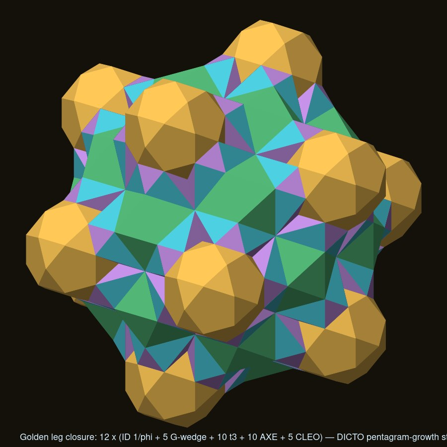 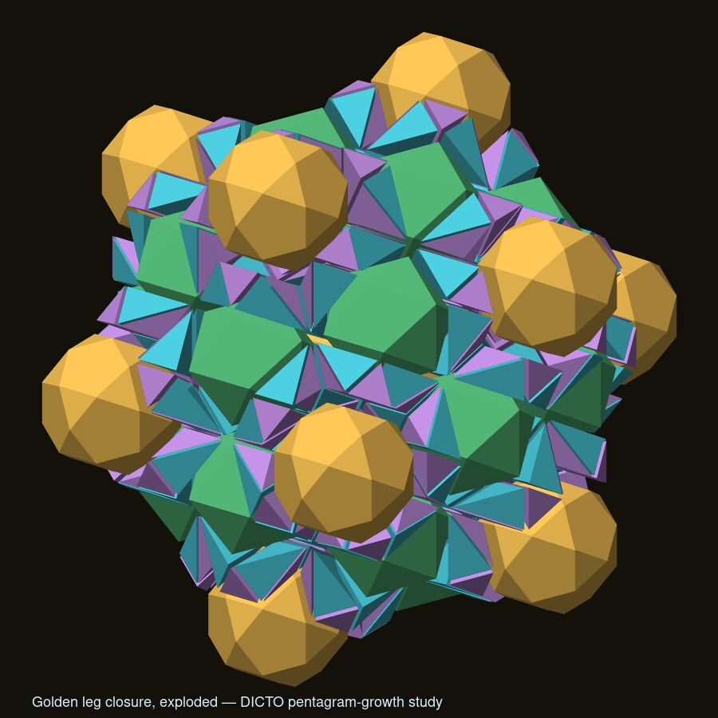 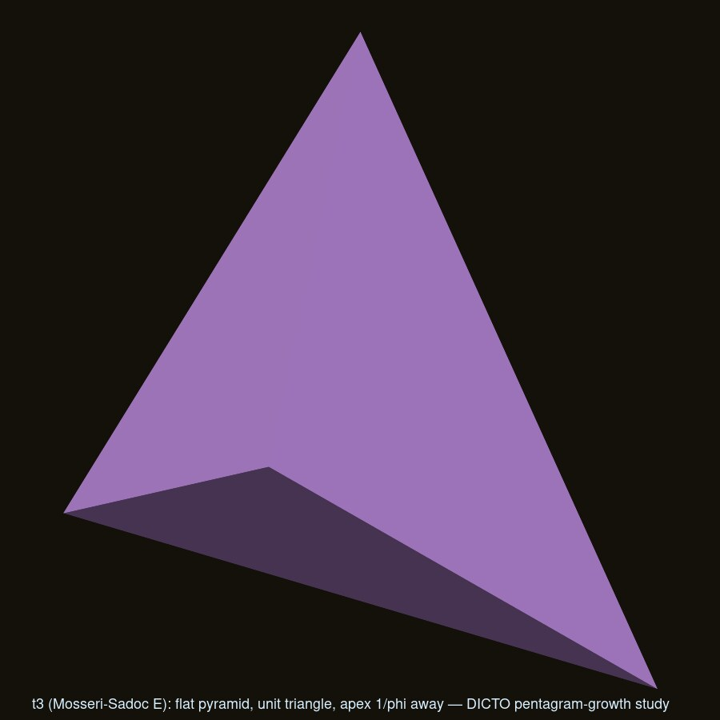

**Small dodecahedron: impossible with the library.** The 63.43° leg crevice lies between two unit equilateral
triangles. The library's equilateral-to-equilateral dihedrals are 41.81° (AXE, half AXE, FUJI) and 138.19° (t1,
J2, J11, half J2), and no chain of up to 4 pieces through other face types sums to 63.43° (0 angle-chains).
The derived tetrahedron (Y, A, C, Z) fills it (edges 1 ×5 and 0.910593, volume √5/20, dihedrals 63.43°, 68.33°,
72.83° ×4, `data/derived-dod-piece`): its angles are not golden, so this growth leaves the family.

**Kepler star: impossible with the library.** The 26.06° leg crevice is smaller than every dihedral in the library
(the smallest is 31.72°, half AXE and the CLEO third), so no piece can even enter it. The derived tetrahedron
(Y, A, B, Z) fills it (edges 1 ×4, 1/φ, 0.525731, volume √5/60, `data/derived-kepler-piece`); its 0.525731 edge is
the J2 height, again not a golden length. So the Kepler layer stays as built: whole-face contacts, with 60
crevices of 26.06° between the spikes and the icosahedra. (§3's "no crevice at the contacts" means exactly this.)

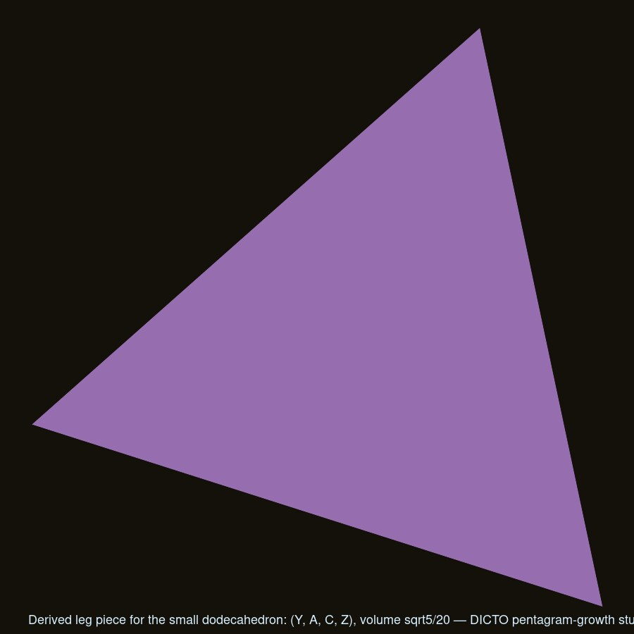 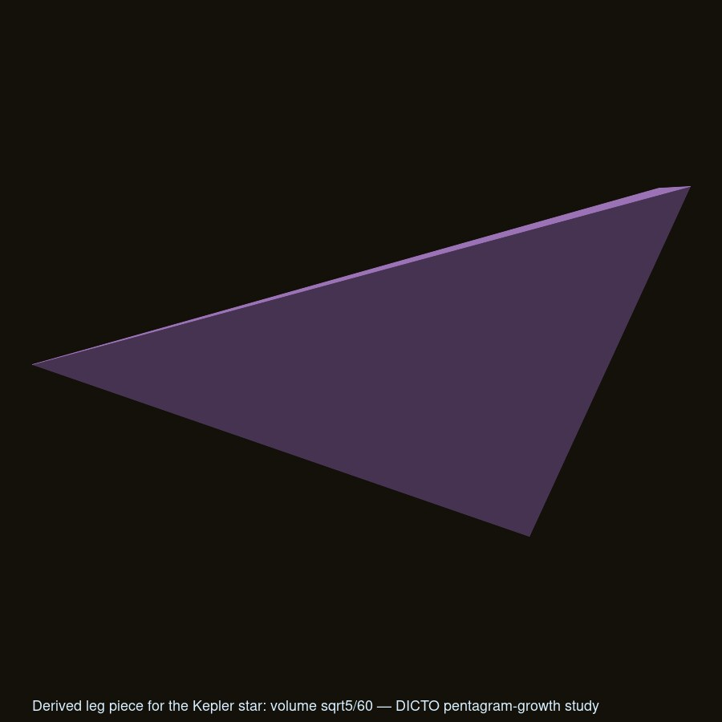

**Earlier library-only greedy runs** (`growth6.mjs`, `growth10`–`growth12`) are superseded by the above: they
either glued pieces with partial face contacts (AXE's golden face over the gnomon) or wandered outward.

New shape needing a name: **E-cap** (t3). New result: the **golden leg closure** (working label) of §10, 31 pieces
per pentagram. Question 6 for DICTO: is the tiled-pentagon contact (three triangles on one pentagon) acceptable
as a contact, as FUJI's base is in the Lotus seed?

## Files

`data/`: `kepler-layer` (+ `-parts`), `kepler-star-11` (+ `-parts`), `kepler-chain-parts`, `unity6`, `deshi6`
(+ `-parts`), `id-gwedges` (+ `-parts`), `t2-gnomon-wedge`, `king-on-pentagram`, `king-spires` (+ `-parts`),
`bud` (+ `-parts`), `buds` (+ `-parts`), `buds-level2` (+ `-parts`), `small-corona-parts-on-pentagram`,
`closure-*-parts`; each in unit and raw scale with the checks it passed. `renders/`: the JPGs above
(icosahedra green, icosidodecahedra and dodecahedra and Kepler stars gold, AXE and wedges cyan, CLEO and
pyramids purple).
